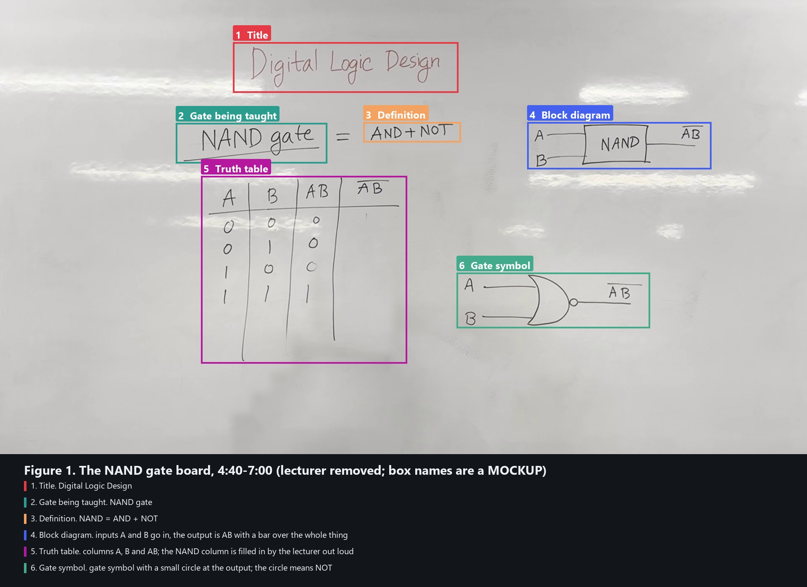

> **MOCKUP.** Written by hand to show the target format for one section. Not pipeline output.
> Real parts: the board picture (lecturer removed), the six boxes (found by
> `board_regions.py` from the ink on the board), and the lecturer's quotes (from the
> fine-tuned transcript). Hand-written parts: the box names and all the text. In the
> real pipeline, Qwen2.5-VL names each numbered box and the notes model writes this text.

# Lecture 7: Universal gates

## The NAND gate

**In one line:** a NAND gate is an AND gate followed by a NOT gate. The lecturer writes
exactly that on the board: **NAND = AND + NOT** (orange box 3).

### How it works

Look at the block diagram in the **blue box 4**. Two inputs, A and B, go into the NAND box,
and the result comes out on the right:

1. **First, AND.** The gate multiplies the inputs: A · B.
2. **Then, NOT.** It flips the result. That is why the lecturer draws one bar over the
   *whole* AB: the output is (AB)', "not (A and B)".

> **Lecturer:** "and mane ami kichilo multiplication. so a into b. erpor ami ki korbo? not
> korbo. so ab er upore ekta whole bar"
> *(AND means multiplication, so A times B. Then what do I do? NOT. So one bar over the whole AB.)*

### The truth table

The **purple box 5** is the truth table. On the board it has the columns A, B and AB; the
lecturer fills in the NAND column out loud, by flipping every AB value:

| A | B | AB | NAND = (AB)' |
|---|---|---|---|
| 0 | 0 | 0 | **1** |
| 0 | 1 | 0 | **1** |
| 1 | 0 | 0 | **1** |
| 1 | 1 | 1 | **0** |

> **Lecturer:** "lastly ei one ta hoechebe ki? zero. so ei je column ta, ei ta hocche amar
> nand gate er output."
> *(And this last 1 becomes what? 0. So this column is the NAND gate's output.)*

**Remember:** a NAND gate gives **0 only when both inputs are 1**. In every other case it
gives 1.

### The symbol

The **green box 6** is the gate symbol. The small circle at the output is the NOT. Heads
up: the shape drawn on this board has the curved back of an OR gate; the standard NAND
symbol has the flat back of an AND gate with the same circle.

### Where this fits

This lecture covers the two *universal gates*, NOR and NAND. NAND is the second one.

*Background, not said in this lecture:* "universal" means any other gate can be built
from NAND gates alone.

### Check yourself

1. What does a NAND gate output when A = 1 and B = 1?
2. Why is the bar drawn over the whole AB and not over A and B separately?

Answers

1. 0. It is the only input pair that gives 0.
2. Because the NOT is applied after the AND, to the result AB. Separate bars (A'B') would
   be a different gate.

