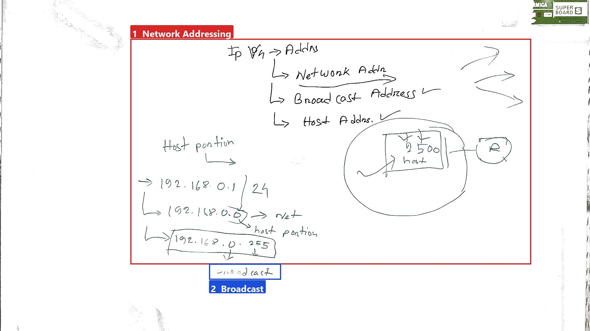
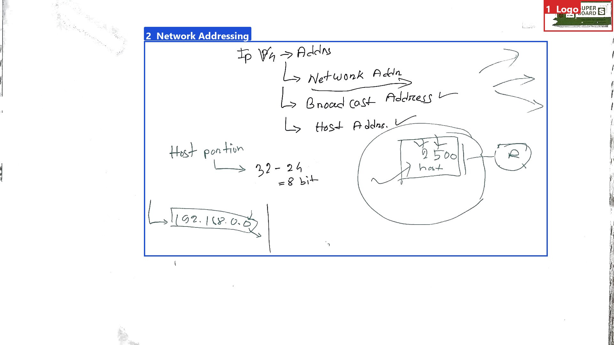
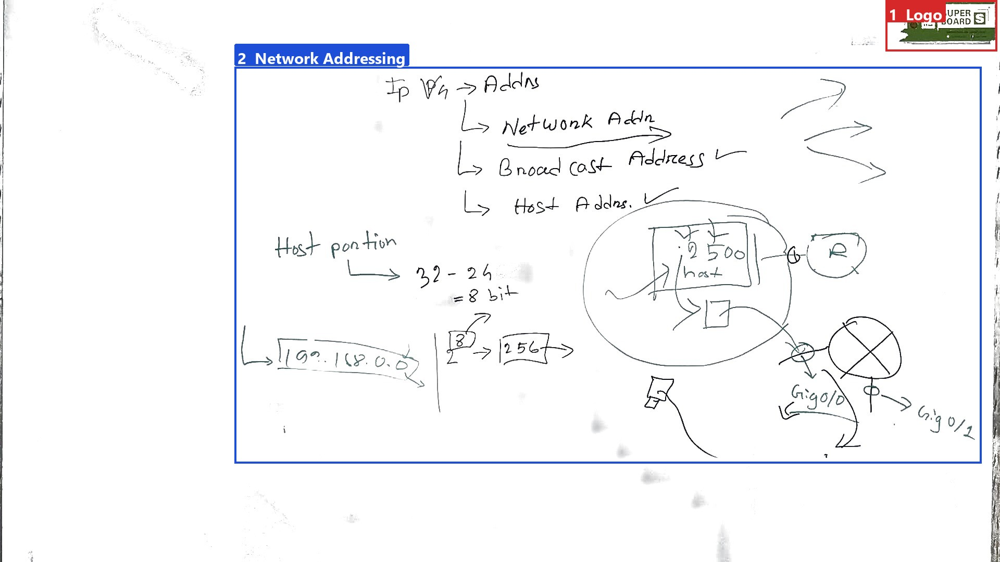
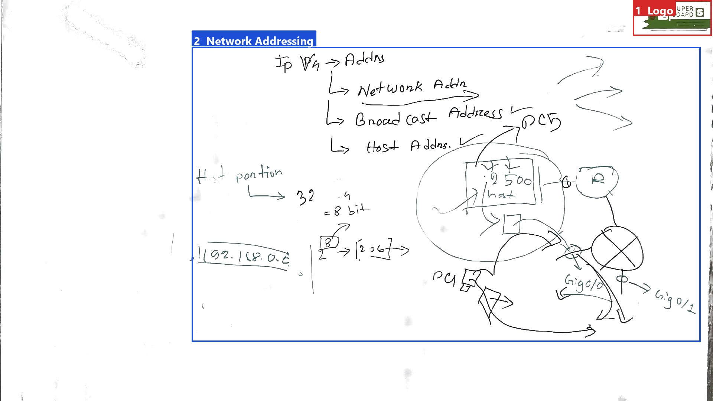
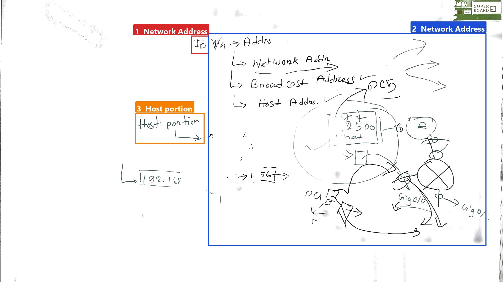
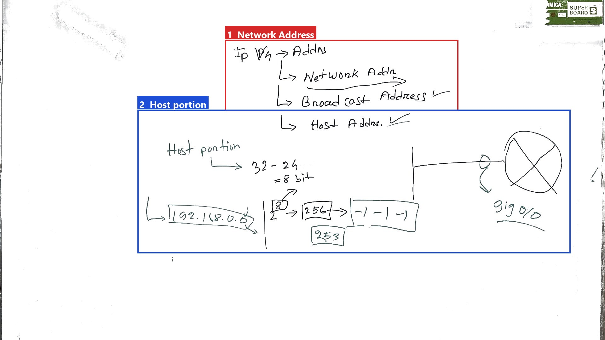

# BanglaASR33: Network Addressing and Broadcast Address
This lecture covers IP addressing and broadcast addresses.

## Key takeaways
- Network address, broadcast address, and host address are crucial components of IP addressing.
- Understanding how to calculate and use these addresses is essential for managing networks effectively.
- The host portion of an IP address determines how many hosts can be accommodated within a network segment.
- Network addresses are used to identify a network segment, while broadcast addresses are used to send data to all devices on a network.
- Host addresses are assigned to individual devices on the network.

<!-- boxes: 1=#d62828 2=#1d4ed8 -->
## Network Addressing and Broadcast Address
**Ek line e:** This lecture covers IP addressing and broadcast addresses.

*Figure 1. The whiteboard during 0:30–5:20, reconstructed with the lecturer removed; background whitened for readability (the writing is the camera's own pixels). Boxes found from the ink; names by Qwen/Qwen2.5-VL-7B-Instruct.*

**Boxes:** 1 Network Addressing · 2 Broadcast

1. **Red Box 1 (Network Addressing):** The board starts with a sequence of address types: IP Adrs -> Addrs -> Network Adr -> Broad cast Adress -> Host Adr. The host portion is highlighted as 192.168.0.1/24, 192.168.0.0 -> net, 192.168.0.255 -> host portion, and 192.168.0.255 -> broadcast.

2. **Blue Box 2 (Broadcast):** The term "broadcast" is mentioned, indicating that the focus will be on broadcast addresses.

> Lecturer: "ivb phone er address er part I love obviously."

The lecturer explains that an IP address can be broken down into different parts: network address, broadcast address, and host address. The network address is the part that identifies the network, while the host address identifies individual devices within that network.

3. **Network Address:** The network address is the part of the IP address that identifies the network. For example, if a network has 25 devices, all these devices will have the same network address. The network address is derived from the IP address by setting the host portion to zero.

4. **Broadcast Address:** The broadcast address is used to send a message to all devices on the network. It is created by setting the host portion to all ones (255). For instance, if the network address is 192.168.0.0, the broadcast address would be 192.168.0.255.

5. **Host Address:** The host address is the part of the IP address that identifies individual devices on the network. In the given example, if the network has 25 devices, the host address will range from 1 to 25.

6. **Example:** The lecturer uses the example of a network with a router. The router is considered a host device, and there are 25 other hosts on the network. The router needs to send a message to all 25 hosts simultaneously. To do this, the router uses the broadcast address, which is 192.168.0.255 in this case.

7. **Calculation:** The network address is calculated by subtracting the prefix length from 32. For example, if the prefix is /24, the network address is 192.168.0.0, and the host portion is 192.168.0.1 to 192.168.0.255.

**Mone rakho:** Network address, broadcast address, and host address are crucial components of IP addressing. Understanding how to calculate and use these addresses is essential for managing networks effectively.

<!-- boxes: 1=#d62828 2=#1d4ed8 -->
## Blue Box 2: Network Addressing and Broadcast Address
**Ek line e:** Amader network address er generation process er moddhe duisho chab pan nota korte pare.

*Figure 2. The whiteboard during 5:30–6:10, reconstructed with the lecturer removed; background whitened for readability (the writing is the camera's own pixels). Boxes found from the ink; names by Qwen/Qwen2.5-VL-7B-Instruct.*

**Boxes:** 1 Logo · 2 Network Addressing

1. **Network Addresses**: These are the addresses assigned to the network itself. For example, `192.168.0.0` is a network address.
2. **Host Addresses**: These are the addresses assigned to individual devices connected to the network. The host portion of an IP address is derived from the total bits minus the network bits.
3. **Host Portion Calculation**: In the given example, we have `32 - 24 = 8` bits for the host portion. This means we can have `2^8 = 256` unique host addresses.
4. **Broadcast Address**: This is the address used to send data to all devices on the network. It is typically the last address in the range, such as `192.168.0.255`.

> Lecturer: "toh ekhane bujha acche je amader basically network ke duisho two to three por eight."

In our example, we have `32 - 24 = 8` bits for the host portion, meaning we can have `256` unique host addresses.

### Extra jana kotha
Ami kintu amader network address er generation process er moddhe duisho chab pan nota korte pare. Eita hocche, ekhanei duisho chab pan nota shob gulai ki apner jei n divers is gula othe. For example, if we have a network where we need to assign addresses to multiple phones and TVs, we will need different addresses for each device. But monokar multiple phone chegulo jono multiple addresses lakbe.

<!-- boxes: 1=#d62828 2=#1d4ed8 -->
## Red Box 1: Introduction to IP Addressing
**Ek line e:** An IP address is assigned to an interface to identify a host on a network.

*Figure 3. The whiteboard during 6:40–8:12, reconstructed with the lecturer removed; background whitened for readability (the writing is the camera's own pixels). Boxes found from the ink; names by Qwen/Qwen2.5-VL-7B-Instruct.*

**Boxes:** 1 Logo · 2 Network Addressing

- **Red Box 1 (Logo: AMICA SUPER BOARD S):** This box introduces the concept of IP addressing, specifically for IPv4 addresses. The logo indicates the brand of the whiteboard used in the lecture.

- **Blue Box 2 (Network Addressing):** The lecturer explains that an interface on a network is assigned an IP address to identify a host. This IP address helps in determining whether data packets are present and can be routed correctly. The lecturer mentions that this IP address can be used to identify the host and understand the network configuration.

- **Red Box 1 (IP V4 -> Addrs):** The lecturer discusses the structure of an IP address, breaking it down into different parts such as network addresses, broadcast addresses, and host addresses. For instance, the IP address `190.168.0.0` is mentioned, which represents the network address.

- **Red Box 1 (Host portion 32 - 24 = 8 bit 190.168.0.0):** The lecturer calculates the host portion of the IP address. Here, `32 - 24 = 8`, indicating that the last 8 bits of the IP address represent the host portion. The example given is `190.168.0.0`, which is a network address.

- **Red Box 1 (256):** The lecturer points out that there are 256 possible host addresses within this network, as each bit in the host portion can have 256 different values (0 to 255).

- **Red Box 1 ([illegible]):** The lecturer mentions some illegible text, possibly related to gigabytes or a device named "Gigolo".

- **Red Box 1 (Gigolo/1):** The lecturer refers to a device called "Gigolo" and its configuration, but the exact details are unclear due to the illegibility.

**Quotes:**
> Lecturer: "so erokon onek gula gigabyte code dia gula kare thake. elgibaste sathe. toh basically, ei ekhane eta switch e thakte pare, apre ne tarla jende design korar ki, abar jodi great depend kora basically."

**Extra jana kotha:** Understanding IP addressing is crucial for network communication. Each host on a network is uniquely identified by its IP address, which helps in routing data packets to the correct destination. The host portion of the IP address determines how many hosts can be accommodated within a network segment.

<!-- boxes: 1=#d62828 2=#1d4ed8 -->
## Blue Box 2: Network Addressing

**Ek line e:** This box explains the different types of addresses in IP V4 addressing.

*Figure 4. The whiteboard during 8:20–9:02, reconstructed with the lecturer removed; background whitened for readability (the writing is the camera's own pixels). Boxes found from the ink; names by Qwen/Qwen2.5-VL-7B-Instruct.*

**Boxes:** 1 Logo · 2 Network Addressing

- **Network Addresses:** These are addresses used to identify a network segment.
- **Broadcast Address:** This address is used to send a packet to all devices on a network.
- **Host Addresses:** These are addresses assigned to individual devices on the network.

The box also mentions the host portion, which is 32 bits long, and can be broken down into 8-bit segments. For example, `192.168.0.250` is a host address, where `250` is the last octet representing the host portion.

### Extra jana kotha (lecture e bola hoy ni)
This breakdown helps in understanding how IP addresses are structured and how they are used to route packets between devices. Knowing the host portion is crucial for identifying specific devices within a network.

**Mone rakho:** Network Addresses, Broadcast Address, Host Addresses, 32 bits, 8-bit segments, 192.168.0.250, host portion.

<!-- boxes: 1=#d62828 2=#1d4ed8 3=#f77f00 -->
## Red Box 1: Network Address: IP
**Ek line e:** IP V4 -> Addrs

*Figure 5. The whiteboard during 9:10–9:52, reconstructed with the lecturer removed; background whitened for readability (the writing is the camera's own pixels). Boxes found from the ink; names by Qwen/Qwen2.5-VL-7B-Instruct.*

**Boxes:** 1 Network Address · 2 Network Address · 3 Host portion

The lecturer starts by explaining that there are two main components of an IP address: the network address and the host address. He points out that the network address is further divided into different parts, such as the network portion and the host portion. The first part of the board shows the structure of an IP address, starting with "IP V4 -> Addrs".

1. **Network Address**: The lecturer explains that the network address is the part of the IP address that identifies the network to which a device is connected. It is further broken down into the network portion and the host portion. The network portion is used to identify the network, while the host portion is used to identify the specific device within that network.

2. **Host Portion**: The lecturer then focuses on the host portion, which is represented by the numbers following the network portion. For example, he mentions "192.168" and "1.567" as possible host portions. He uses these examples to illustrate how the host portion can vary depending on the specific network configuration.

> Lecturer: "toh, er source ne pojomoto eita thakbe, aa destination me ek thakbe eita."

The lecturer emphasizes that the source and destination addresses are essential in routing data packets. He explains that when a packet is sent from one device to another, it needs to pass through routers, which use the routing table to determine the best path for the packet to travel. This process involves multiple steps, and the routers need to understand the network and host portions of the IP address to forward the packet correctly.

### Extra jana kotha
Understanding the network and host portions of an IP address is crucial for network administrators and students studying computer networks. Knowing how these portions work helps in configuring network devices and troubleshooting connectivity issues. By breaking down the IP address into its components, we can better understand how data is routed across different networks.

<!-- boxes: 1=#d62828 2=#1d4ed8 -->
## Red Box 1: Network Address: IP

**Ek line e:** In this section, we will discuss network addresses and their components.

*Figure 6. The whiteboard during 10:40–12:02, reconstructed with the lecturer removed; background whitened for readability (the writing is the camera's own pixels). Boxes found from the ink; names by Qwen/Qwen2.5-VL-7B-Instruct.*

**Boxes:** 1 Network Address · 2 Host portion

1. **Red Box 1 (Network Address: IP Adrs -> Addrs -> Network Addr -> Broad cast Addr -> Host Addr):**
   - The lecturer starts by explaining the different types of addresses in an IP address system. He mentions that understanding these addresses is crucial for determining which devices can be used and how they interact within a network.
   - The sequence of addresses is shown as: IP Adrs -> Addrs -> Network Addr -> Broad cast Addr -> Host Addr.

2. **Blue Box 2 (Host portion):**
   - The lecturer explains the host portion of the IP address. He states that the host portion is 32 - 24 = 8 bits.
   - He provides an example using the IP address 192.168.0.0, showing that the range is from 256 to 253, with 253 being the broadcast address.

> Lecturer: "usable bolta apne in devices, apner phone laptop ke ve e eglo ki dekane ki hobe?"

### Extra jana kotha
Understanding the different parts of an IP address helps in identifying which devices can be used and how they communicate within a network. For instance, knowing the network address allows us to determine which devices belong to the same network segment, while the broadcast address is used to send data to all devices in that segment. The host address specifies the unique identifier for each device on the network.

---

## Check yourself
1. What is the network address for the IP address 192.168.0.0/24?
2. How many unique host addresses can be assigned in a /24 network?
3. What is the broadcast address for the network 192.168.0.0/24?
4. Explain the difference between a network address and a host address.
5. Why is it important to understand the host portion of an IP address?

### Answers
1. The network address for the IP address 192.168.0.0/24 is 192.168.0.0.
2. In a /24 network, 256 unique host addresses can be assigned.
3. The broadcast address for the network 192.168.0.0/24 is 192.168.0.255.
4. A network address identifies the network to which a device is connected, while a host address identifies the specific device within that network.
5. Understanding the host portion of an IP address is important for identifying specific devices within a network and for configuring network devices.

---

*How these notes were made. Speech: transcript.txt. Boards: ink boxes, named by Qwen/Qwen2.5-VL-7B-Instruct. Notes written by Qwen/Qwen2.5-7B-Instruct. Quotes checked word for word against the transcript: 5 kept, 0 removed. References to boxes that do not exist: 0.*
