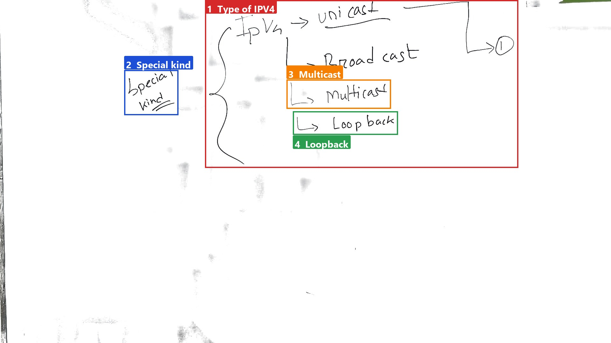
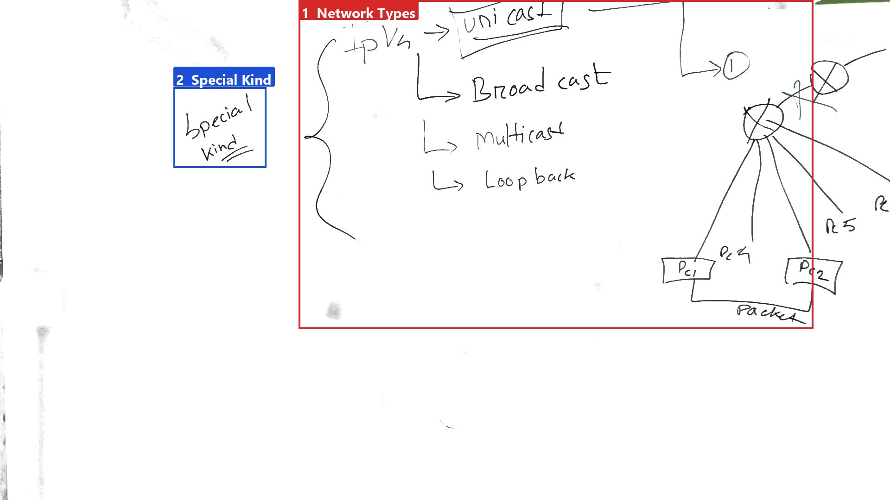
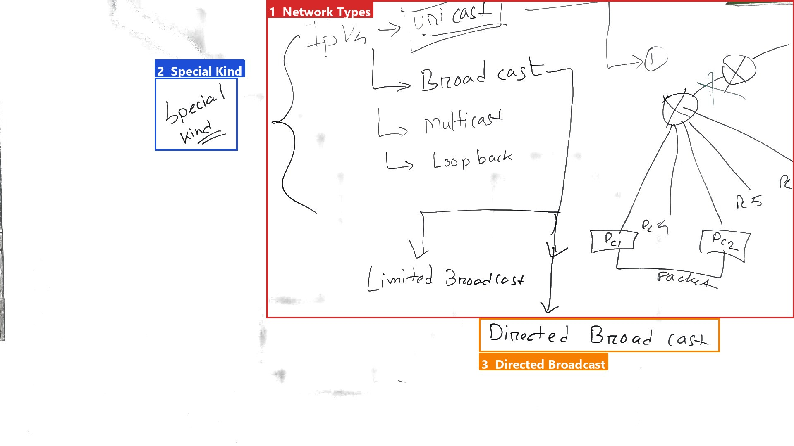
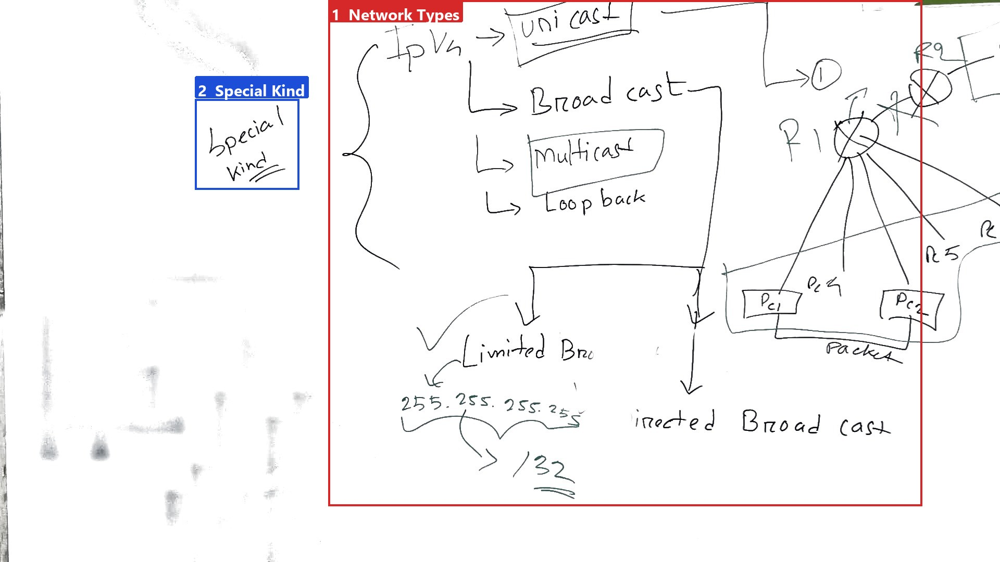
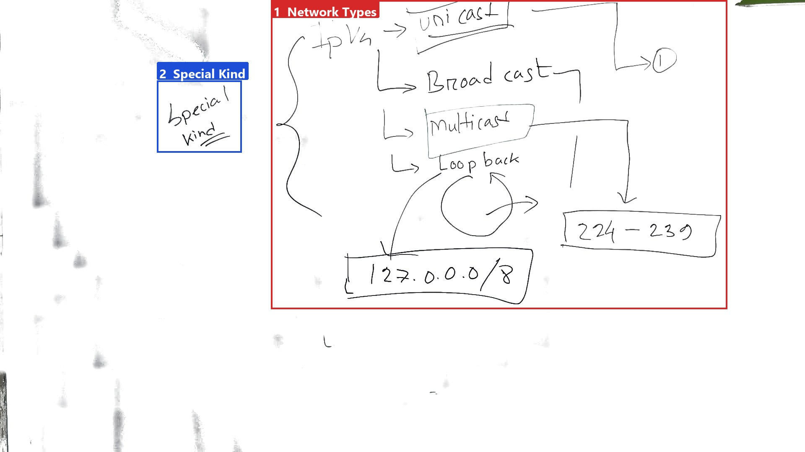

# BanglaASR34: Introduction to IP Addressing: IPv4 Types
Today we will discuss different types of IPv4 addresses.

## Key takeaways
- Unicash hocche just duita moddhe, duijon er moddhe jekono amra kono information ba packet ba frame adampudon korbo.
- Directed broadcast ta holo jokhn ami ei same network kei shogular device kase nite chabo.
- Special kind: Unicash, broadcast, multicast, loopback, limited broadcast, and injected broadcast.
- 224-239 range er address ta use korbo multicast communication.
- 127.0.0.0/8 er address ta use korbo loopback.

<!-- boxes: 1=#d62828 2=#1d4ed8 3=#f77f00 4=#2a9d4f -->
## Introduction to IP Addressing: IPv4 Types
**Ek line e:** Today we will discuss different types of IPv4 addresses.

*Figure 1. The whiteboard during 0:00–1:26, reconstructed with the lecturer removed; background whitened for readability (the writing is the camera's own pixels). Boxes found from the ink; names by Qwen/Qwen2.5-VL-7B-Instruct.*

**Boxes:** 1 Type of IPV4 · 2 Special kind · 3 Multicast · 4 Loopback

- **Box 1 (red):** Type of IPV4: IPv4 → unicast
- **Box 2 (blue):** Special kind
- **Box 3 (orange):** Multicast: IPv4 → Multicast
- **Box 4 (green):** Loopback: IPv4 → Loopback

The whole board shows the different types of IPv4 addresses: unicast, broadcast, multicast, and loopback. Let's go through each type one by one.

### Explanation
1. **Unicast (Box 1, red):** This is the most common type of IPv4 address. It is used to identify a single device on the network. For example, if you have a router and two PCs connected to it, each device will have a unique unicast address.
2. **Broadcast (not explicitly shown but implied):** This type of address is used to send data to all devices on a network segment. We will discuss this in more detail in the next video.
3. **Multicast (Box 3, orange):** This type of address is used to send data to multiple devices simultaneously. It is useful for applications like video conferencing or streaming.
4. **Loopback (Box 4, green):** This type of address is used for testing and debugging purposes. It allows a device to communicate with itself.

**Lecturer:** "Second ei ajbe broadcast. broadcast ni amra previous video ta ektu khub e upore layer e alo chono kore chila mas ke amra etu in depth dekhbo je pothorone broadcast address ta ke and all. because this is important."

### Extra jana kotha
All these types of addresses are special kinds of addresses. When we say "special kind," it means they have specific uses and properties. For example, a unicast address is unique, meaning each device on the network has a distinct address. This uniqueness is crucial for proper communication between devices.

<!-- boxes: 1=#d62828 2=#1d4ed8 -->
## Special Kind: Unicast

**Ek line e:** Unicash hocche just duita moddhe, duijon er moddhe jekono amra kono information ba packet ba frame adampudon korbo.

*Figure 2. The whiteboard during 1:30–3:04, reconstructed with the lecturer removed; background whitened for readability (the writing is the camera's own pixels). Boxes found from the ink; names by Qwen/Qwen2.5-VL-7B-Instruct.*

**Boxes:** 1 Network Types · 2 Special Kind

- **Box 1 (red):** Network Types: Unicast, Broadcast, Multicast, Loopback
- **Box 2 (blue):** Special Kind: Special Kind

The lecturer explains that unicast is used when we want to send a message from one host to another specific host. For example, if you want to send a message to your friend, you send it directly to their device without broadcasting it to everyone.

- **Box 2 (blue):** Special Kind

The lecturer further clarifies that in unicast, we use a unique address to send packets from one host to another. This unique address is the IP address of the destination host. The lecturer emphasizes that this is a native communication between two hosts.

- **Box 1 (red):** Network Types: Unicast

The lecturer points out that unicast is just one type of network communication. There are other types like broadcast, multicast, and loopback.

- **Box 1 (red):** Network Types: Broadcast

The lecturer mentions that broadcast is a limited broadcast type, where the message is sent to all devices on the network.

- **Box 1 (red):** Network Types: Multicast

The lecturer also mentions multicast, which is another type of communication where the message is sent to multiple devices simultaneously.

- **Box 1 (red):** Network Types: Loopback

Finally, the lecturer talks about loopback, which is a special type of communication where the message is sent back to the same host.

### Extra jana kotha (lecture e bola hoy ni)
Unicash is a fundamental concept in networking where a message is sent from one host to another specific host using a unique IP address. This is different from broadcast, where the message is sent to all devices on the network, and multicast, where the message is sent to multiple devices simultaneously. Understanding these different types of communication is crucial for effective network design and management.

<!-- boxes: 1=#d62828 2=#1d4ed8 3=#f77f00 -->
## Network Types: Special Kind
**Ek line e:** Today we will discuss Directed Broadcast.

*Figure 3. The whiteboard during 3:10–3:58, reconstructed with the lecturer removed; background whitened for readability (the writing is the camera's own pixels). Boxes found from the ink; names by Qwen/Qwen2.5-VL-7B-Instruct.*

**Boxes:** 1 Network Types · 2 Special Kind · 3 Directed Broadcast

1. **Red Box 1:** The first thing to note is the different types of network communication: Unicast, Broadcast, Multicast, Loopback, Limited Broadcast, and Directed Broadcast.
2. **Blue Box 2:** We are focusing on the special kind of communication, which includes Directed Broadcast.
3. **Orange Box 3:** Directed Broadcast is a specific type of broadcast where a packet is sent to all devices on a particular network segment.

The diagram on the board illustrates how packets are transmitted. There is a packet being sent from PC1 to PC2, and both PCs are connected to a central node labeled "Router." This router is connected to multiple devices (PC1 and PC2) via lines labeled "R1," "R2," "R3," "R4," "R5," and "R6."

> Lecturer: "toh limited broadcast ta holo jokhn ami ei same network kei shogular device kase nite chabo."
>
> Lecturer: "eta shudhu mar drar network er moddhe thakte pare. eta same bhabe ei je router ta kokhone limited broadcast network forward kore naah, onno router ekhase."

In simple terms, a Directed Broadcast is used when you want to send a message to all devices on the same network segment. For example, if we label the router as R1 and another router as R2, and we want to send a message to all devices on the network served by R1, we would use a Directed Broadcast. This message can only travel within the same network segment; the router R1 will not forward this message to other networks.

### Extra jana kotha
Directed Broadcast is a method of sending a packet to all devices on a specific network segment. It is useful for administrative purposes but should be used cautiously as it can cause network congestion if misused. Understanding Directed Broadcast helps in managing network traffic effectively.

<!-- boxes: 1=#d62828 2=#1d4ed8 -->
## Box 1 (red) and Box 2 (blue): Network Types and Special Kind
**Ek line e:** Limited broadcast is a special kind of broadcast where a message is sent to all devices on the same network.

*Figure 4. The whiteboard during 4:20–5:36, reconstructed with the lecturer removed; background whitened for readability (the writing is the camera's own pixels). Boxes found from the ink; names by Qwen/Qwen2.5-VL-7B-Instruct.*

**Boxes:** 1 Network Types · 2 Special Kind

- **Box 1 (red)**: This box lists different types of network communication: Unicast, Broadcast, Multicast, Loopback, Limited Broadcast, and Injected Broadcast. Each type serves a specific purpose in network communication.
  
- **Box 2 (blue)**: This box focuses on the concept of Special Kind, specifically highlighting Limited Broadcast.

The lecturer explained that a **limited broadcast** is essentially a directed broadcast. If you want to send a message to all devices within the same network, you would use a limited broadcast. However, if you want to send a message to multiple networks, you would use a directed broadcast. The key point here is that a limited broadcast is confined to a single network, whereas a directed broadcast can span multiple networks.

The lecturer further clarified that the address `255.255.255.255` is used to represent a network where all devices are considered part of the same network segment. This address is used when you need to communicate with all devices on a particular network.

**Quotes:**
> Lecturer: "directed broadcast ki? ami jodi ei same network er ei je message ta ami dicchi, ei message ta ami ami message ta jodi ami ar two er ei je network ta ache, egulo kase dite chai, tokhan ami iskom directed broadcast."

### Extra jana kotha (lecture e bola hoy ni)
In a limited broadcast, the address `255.255.255.255` is used to send a message to all devices on the same network. This is useful for network discovery and troubleshooting purposes. For example, if you want to ping all devices on your local network, you would use the limited broadcast address.

<!-- boxes: 1=#d62828 2=#1d4ed8 -->
## Box 5 (Special Kind)

**Ek line e:** In this section, we will discuss special kinds of IP addresses.

*Figure 5. The whiteboard during 5:50–7:46, reconstructed with the lecturer removed; background whitened for readability (the writing is the camera's own pixels). Boxes found from the ink; names by Qwen/Qwen2.5-VL-7B-Instruct.*

**Boxes:** 1 Network Types · 2 Special Kind

- **Box 1 (red)**: This box lists different types of networks: Unicast, Broadcast, Multicast, and Loopback. Loopback is a special type of network where the IP address is used for testing purposes within the local system. The Loopback address is 127.0.0.0/8.
- **Box 2 (blue)**: This box mentions Special Kind, which refers to specific IP address ranges.

The board shows the following:

| Special | kind |
|---------|------|
| IPv4 -> | Unicast |
|         | Broadcast |
|         | Multicast |
|         | Loopback |
|         | 127.0.0.0/8 |
|         | [224 - 239] |

**Explanation:**
- The lecturer explains that if we have a range of addresses, specifically from 224 to 239, these are special addresses used for multicast communication.
- He states, "tokhon e amra jodi shudhu motro jodi duishe chobish theke duisho uno jor list dekhi. tokhon e amra marty kache jabe use korbo. 224. 224 theke aa 239. ei range tae marty kache jone pojote hoche." This means, "If we have a list of addresses from 224 to 239, we can use these addresses for multicast communication."
- He further clarifies, "kotha hoite baite hobe? ekta network ke jabe, kinti ekta network ke jebe, kinti ekta network ke individual kichu device, obviously more than two hoye tebe, nao like toh unique," meaning, "What should we do? We need a network, a network that includes a single device, obviously more than two devices, and unique."
- The lecturer explains the concept of a loopback address, stating, "je host theke eta ashbe, ei host ta kache fira jabe. etar net rock diye for-or hoy nake koror switch diye for-or e. eta just apne ar trouble shooting e jono use kore, just dekhe jbo chaaka layer ekta device er chaaka layer e, thikbabe kaj kortese ki ne." This means, "If a host needs to communicate with itself, it uses a loopback address. This helps in testing and troubleshooting, allowing us to check the layers of a device directly."
- He also mentions, "tarjon nor switch ta, hae, switch ta onekshomai jaite pare, but obviously, switch ta loop break kore abr switch ei fira, mane device ei fira jabe host ta ar ki." This means, "After a switch, many switches can be connected, but obviously, a switch breaks the loop and connects the device to the host."
- Finally, he concludes, "eita diye mani usually amra hocche ei loop make er kaj ta kore theki ar ki. so eipor jonno ekta loop make er kaj ta kore theki." This means, "Usually, we understand that making a loop is for testing purposes. So, we do this to test the loop."

**Mone rakho:** The key points are that the range 224-239 is used for multicast, and the loopback address 127.0.0.0/8 is used for testing within the local system.

---

## Check yourself
1. What is the most common type of IPv4 address?
2. How does a directed broadcast differ from a limited broadcast?
3. Which range of IP addresses is used for multicast communication?
4. What is the loopback address and its purpose?
5. What are the different types of network communication mentioned in the lecture?

### Answers
1. Unicash hocche theke duita moddhe, duijon er moddhe jekono amra kono information ba packet ba frame adampudon korbo.
2. Directed broadcast ta holo jokhn ami ei same network kei shogular device kase nite chabo, kintu limited broadcast ta holo jokhn ami ei same network er moddular device kase nite chabo.
3. 224-239 range er address ta use korbo multicast communication.
4. 127.0.0.0/8 er address ta use korbo loopback. Ei address ta use korbo testing and debugging purposes.
5. Unicash, broadcast, multicast, loopback, limited broadcast, and injected broadcast.

---

*How these notes were made. Speech: transcript.txt. Boards: ink boxes, named by Qwen/Qwen2.5-VL-7B-Instruct. Notes written by Qwen/Qwen2.5-7B-Instruct. Quotes checked word for word against the transcript: 3 kept, 1 removed. References to boxes that do not exist: 1.*
