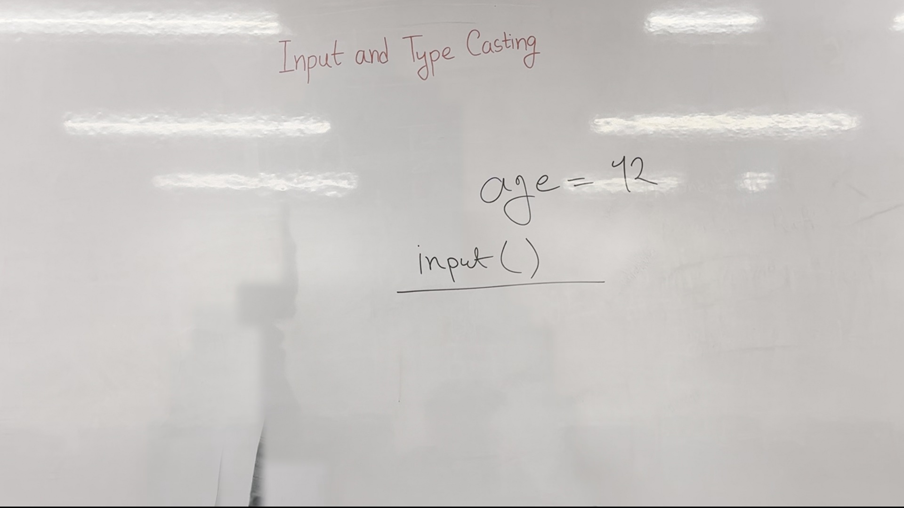

# Lecture Notes: Introduction to Variables and User Input in Python

## 1. Introduction to Variables
In the previous class, we discussed the concept of variables and their declaration. A variable is a named location in memory that stores a value. Understanding how to declare and manipulate variables is fundamental in programming.

### 1.1 Declaring Variables
To declare a variable in Python, you simply assign a value to a variable name. For example:
```python
name = "Rafi"
```




**Figure 1.** Whiteboard as it stood during 0:00&ndash;1:00, reconstructed from 6 video frames with the lecturer removed. 97.8% of the board is unobstructed.

### 1.2 Data Types
Variables can hold different types of data such as integers, strings, and more. Understanding the data type is crucial as it determines the operations you can perform on the variable.

## 2. User Input in Python
Today, we will explore how to take input from the user using the `input` function. This function allows us to interact with the user and gather dynamic data.


**Figure 2.** Whiteboard as it stood during 1:10&ndash;3:10, reconstructed from 9 video frames with the lecturer removed. 97.9% of the board is unobstructed.

### 2.1 Using the `input` Function
The `input` function in Python is a built-in function that prompts the user to enter some text. Whatever the user types is returned as a string.

#### Example:
```python
name = input("What is your name?")
print(f"Hello, {name}!")
```

### 2.2 Practical Example
Let's demonstrate how to use the `input` function in a practical scenario.


**Figure 3.** Whiteboard as it stood during 4:20&ndash;7:30, reconstructed from 10 video frames with the lecturer removed. 98.5% of the board is unobstructed.

#### Step-by-Step Code:
1. Prompt the user to enter their name.
2. Store the input in a variable.
3. Print a personalized greeting.

```python
# Prompt the user for their name
name = input("What is your name?")

# Print a personalized greeting
print(f"Hello, {name}!")
```

### 2.3 Type Casting
Sometimes, we need to convert the input data from a string to another data type like an integer. This process is called type casting.

#### Example:
```python
num1 = input("Enter the first number:")
num2 = input("Enter the second number:")

# Convert the input strings to integers
num1 = int(num1)
num2 = int(num2)

# Perform addition
result = num1 + num2

# Print the result
print(f"The sum is {result}")
```

### 2.4 F-Strings for Formatting
Python 3 introduced f-strings, which provide a concise way to embed expressions inside string literals.


**Figure 4.** Whiteboard as it stood during 8:40&ndash;14:00, reconstructed from 7 video frames with the lecturer removed. 98.6% of the board is unobstructed.

#### Example:
```python
name = input("What is your name?")
num1 = int(input("Enter the first number:"))
num2 = int(input("Enter the second number:"))

sum_result = num1 + num2

# Print the result using an f-string
print(f"Hello, {name}! The sum of {num1} and {num2} is {sum_result}.")
```

## 3. Summary
Today, we learned about user input in Python using the `input` function. We covered how to prompt users for input, store the input in variables, and perform type casting to convert string inputs into integers. Additionally, we explored the use of f-strings for formatting output. These skills are essential for building interactive and dynamic programs.

By understanding these concepts, you can create programs that interact with users and process their input effectively.

---

*Figures are reconstructed whiteboards. Each is assembled from tiles taken from moments when the lecturer was not standing in front of that part of the board, so every pixel is unmodified video; nothing is generated. A figure shows the board's state across the time range given, not a single instant. Boards less than 95% clear of the lecturer were left out (1 of 5 here).*
