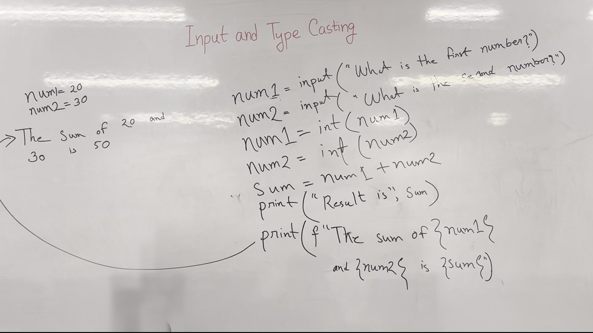

# Introduction to Variables and User Input in Python

This lecture introduces the concept of variables and user input in Python, focusing on how to declare variables, handle different data types, and perform type casting.

## Key takeaways
- Variables in Python can hold different types of data.
- The `input()` function allows user input.
- Type casting is necessary when performing arithmetic operations with user inputs.
- Python 3 supports formatted string literals (`f-strings`).

## Input and Type Casting
The `input()` function is a built-in Python function that allows the program to take input from the user. The input is always treated as a string unless explicitly converted.

### Core Idea
Variables can be declared and assigned values using the `input()` function. However, when performing arithmetic operations, the input needs to be converted to the appropriate data type.

### Example
```python
name = input("What is your name?")
print("Hello", name)
```


*Figure 2. The whiteboard during 1:10–3:10, reconstructed from 9 video frames with the lecturer removed; 98% of the board is unobstructed.*

### Watch out:
- The `input()` function always returns a string, even if the user enters a number.

### Example
```python
num1 = input("What is the first number?")
num2 = input("What is the second number?")
sum = num1 + num2
print(sum)
```


*Figure 3. The whiteboard during 4:20–7:30, reconstructed from 10 video frames with the lecturer removed; 98% of the board is unobstructed.*

### Watch out:
- Directly adding two strings results in concatenation, not addition.

### Example
```python
num1 = input("What is the first number?")
num2 = input("What is the second number?")
num1 = int(num1)
num2 = int(num2)
sum = num1 + num2
print("Result is", sum)
```

### Example
```python
num1 = 20
num2 = 30
print("The Sum of 20 and 30 is 50")
num1 = input("What is the first number?")
num2 = input("What is the second number?")
num1 = int(num1)
num2 = int(num2)
sum = num1 + num2
print("Result is", sum)
print(f"The sum of {num1} and {num2} is {sum}")
```


*Figure 4. The whiteboard during 8:40–14:00, reconstructed from 7 video frames with the lecturer removed; 99% of the board is unobstructed.*

### Watch out:
- Always ensure that the input is converted to the correct data type before performing arithmetic operations.

## Check yourself
1. Write a Python program to take a user's name and print a greeting.
2. Write a Python program to take two numbers from the user and print their sum.
3. Explain the difference between `int()` and `str()` functions.
4. What will happen if you try to add two strings without converting them to integers?
5. How can you use `f-strings` to format the output?

### Answers
1. ```python
   name = input("What is your name?")
   print("Hello", name)
   ```
2. ```python
   num1 = input("What is the first number?")
   num2 = input("What is the second number?")
   num1 = int(num1)
   num2 = int(num2)
   sum = num1 + num2
   print("Result is", sum)
   ```
3. `int()` converts a string to an integer, while `str()` converts a value to a string.
4. Adding two strings results in concatenation, not addition.
5. ```python
   print(f"The sum of {num1} and {num2} is {sum}")
   ```

---

*Figures are reconstructed whiteboards assembled from moments when the lecturer was not standing in front of each part of the board. Every pixel is unmodified video; nothing in them is generated. Each shows the board across the time range given, not a single instant.*