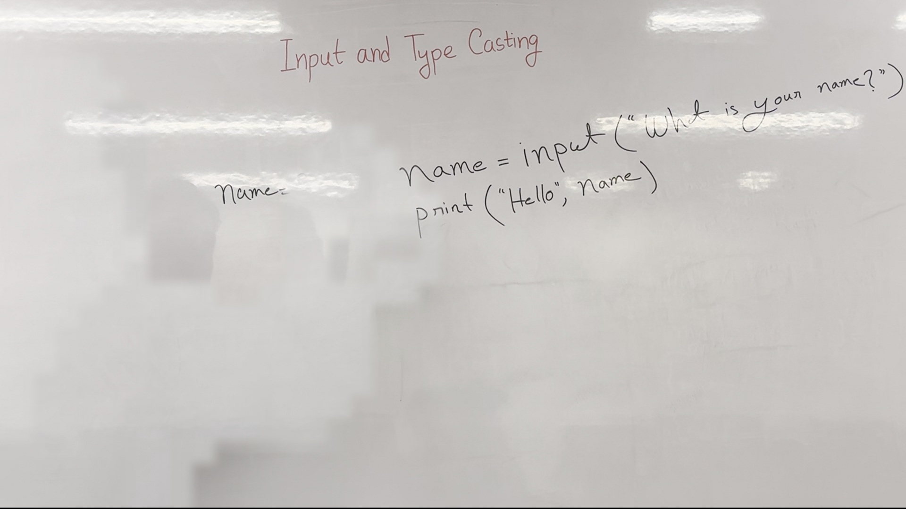
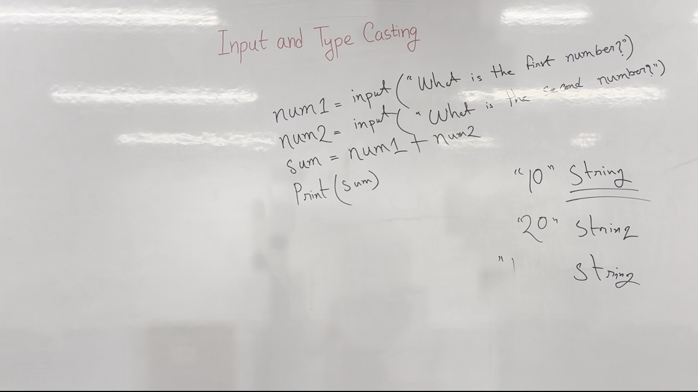

# Introduction to Variables and User Input in Python

In this lecture, we will learn how to use variables and user input in Python. We will cover declaring variables, taking user input, and performing basic operations.

## Key Takeaways
- Understand how to declare and use variables.
- Learn to take user input using the `input()` function.
- Understand the importance of type casting.
- Know how to use formatted string literals (`f-strings`).

## Declaring Variables and Using User Input
Variables are used to store data in a program. In Python, we can declare a variable and assign it a value. However, when taking input from the user, the input is initially treated as a string.

### Example
```python
name = input("What is your name?")
print("Hello", name)
```



*Figure 2. The whiteboard during 1:10–3:10, reconstructed from 9 video frames with the lecturer removed; 98% of the board is unobstructed.*

### Explanation
- `name = input("What is your name?")`: This line prompts the user to enter their name and stores the input in the variable `name`.
- `print("Hello", name)`: This line prints a greeting along with the user's name.

## Performing Arithmetic Operations with User Input
When performing arithmetic operations with user input, we need to ensure that the inputs are treated as numbers, not strings.

### Example
```python
num1 = input("What is the first number?")
num2 = input("What is the second number?")
sum = num1 + num2
print(sum)
```



*Figure 3. The whiteboard during 4:20–7:30, reconstructed from 10 video frames with the lecturer removed; 98% of the board is unobstructed.*

### Explanation
- `num1 = input("What is the first number?")`: This line prompts the user to enter the first number.
- `num2 = input("What is the second number?")`: This line prompts the user to enter the second number.
- `sum = num1 + num2`: This line attempts to add the two inputs, which results in a string concatenation.
- `print(sum)`: This line prints the concatenated string.

### Watch Out:
- The addition of two strings results in string concatenation, not numerical addition.

## Correcting the Mistake
To perform numerical addition, we need to convert the user input from a string to an integer using the `int()` function.

### Example
```python
num1 = input("What is the first number?")
num2 = input("What is the second number?")
num1 = int(num1)
num2 = int(num2)
sum = num1 + num2
print(sum)
```

### Explanation
- `num1 = int(num1)`: This line converts the first input to an integer.
- `num2 = int(num2)`: This line converts the second input to an integer.
- `sum = num1 + num2`: This line performs the addition of the two integers.
- `print(sum)`: This line prints the sum.

## Using Formatted String Literals (`f-strings`)
Python 3 introduced `f-strings`, which allow us to embed expressions inside string literals.

### Example
```python
num1 = input("What is the first number?")
num2 = input("What is the second number?")
num1 = int(num1)
num2 = int(num2)
sum = num1 + num2
print(f"The sum of {num1} and {num2} is {sum}")
```

### Explanation
- `print(f"The sum of {num1} and {num2} is {sum}")`: This line uses an `f-string` to format the output, making it more readable.

## Check Yourself
1. What is the purpose of the `input()` function in Python?
2. How do you convert a string to an integer in Python?
3. What happens when you add two strings together in Python?

## Answers
1. The `input()` function is used to take user input from the console.
2. You convert a string to an integer using the `int()` function.
3. When you add two strings together, Python performs string concatenation, not numerical addition.

---

*Figures are reconstructed whiteboards assembled from moments when the lecturer was not standing in front of each part of the board. Every pixel is unmodified video; nothing in them is generated. Each shows the board across the time range given, not a single instant.*