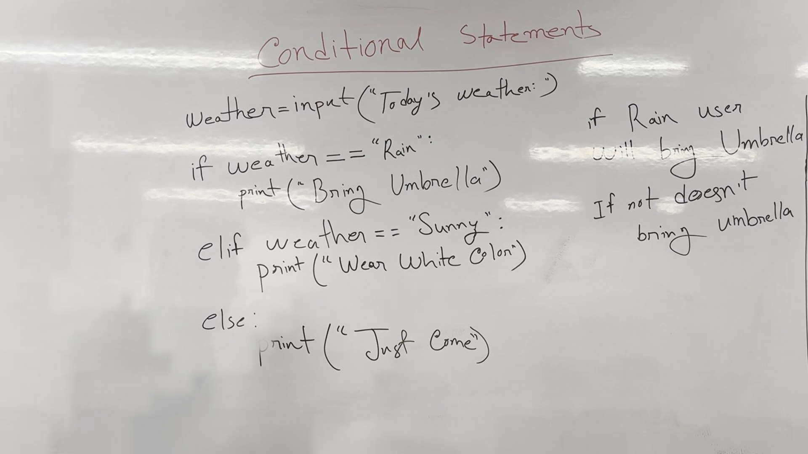

# Conditional Statements and Decision Making in Python

In this lecture, we learned how to make decisions based on user input and different conditions using `if`, `elif`, and `else` statements in Python.

## Key takeaways
- Understand how to use `if`, `elif`, and `else` statements.
- Learn to make decisions based on user input.
- Recognize the importance of correct syntax and indentation.

## Conditional Statements
The core idea is to make decisions based on certain conditions. We start with basic `if`, `else`, and `elif` statements.

### Example: Checking the Weather
Let's see how to implement a simple decision-making process based on the weather.

```python
Weather = input("Today's weather:")
```

**Lecturer:** hello everyone, welcome back to another video. ei video te amra dekhbo, computer kibhabe logical decision gula nei. se ki bhabe user er input er upor base kore ki bhabe se decision nei je ei ta kaaj korte hobe naki korte hobe naah.
ajke variable ta upor desh kore computer ki bhabe decision a. toh cholo shuru kori, amra shuru korbo first a, if, else and elif dia ek technical additional statement khub e simple jinish. amra ashte ashte ar o deep topic a jabo, toh first a cholo dhore nei jodi rain hoy.
okay? so arekta jinish je, if not, amra jinish je, if a rain a user will bring umbrella.
so, jodi reint hoy user amra la arbe, ebong jodi reint jodi na hoy, se amra la arbe na, khub e simple ekta jinish. toh eta po te ki bhabe bujhabo cholo setai shuru gori. first a, weather naamer ekta ami jodi variable
so, today's weather, se ki korbe? input nilo. jeta ki korbe? user er kache te ki ekta input nilo. se ei user ke bolte pare today's mass, today's weather.
so, tarpor amar por lane ashbe holo, if weather equal equal, dekho ekhane kintu abe duitah equal dienshi. thikache? equal equal dia amvoltesi weather jodi amar rain hoy, tarpor per line ashbe holo range dekho, ki tarpor per line a ki, guldi ekta lane er range dekho.
so, user ekta input dibe, ebong input power pore, whether rain na ki, eta check korbe, first a if block a dhuke jabe.
tarpore jodi dekha je rain in block er dhuklo, print korbeshe bring umbrella. ebong jodi weather jodi onno kichu day, rain baadeo jekono jinish, ebong ki rain er jodi aa spelling ke ashe small letter diao likhe, toh buo jinish ta e babe jabe.
so, ei babe jinish ta hocche. user theke input asche, input ta ekta string hisabe. amra string ta ke bhabe match kore dektesi. weather er moddhe input ta string hisabe ache. check kortese je, is it rain? does it equal rain? if yes, ei block er dhukbe, print korbe bring ambela.
toh ei babe if else dite pari. ekhon kotha holo, jodi weather sunny hoy, tokhn ki korbe? toh tahole ami ekta kaaj korte pari, elts ta ekhane kete diye, ami elif naamer arekta conditional statement dite pari.
hello ekhane ami arekta condition dibo. ki dibo? je uh, boltese je weather jodi sunny hoy, tokhn ki, achar, amra for example, we can print, aa, weather jodi sunny hoy, tokhn ki, amra for example, we can print, aa, wabe, wabe wabe, wabe,
tabe chai, tarbo bolte pare weather jodi sunny hoy, tahole program kibol bejio, wear a white color, okay? tarpor amra else o jete pari, else jodi e gula kichu ina hoy, rain jodi naah hoy, sunny o jodi naah hoy, jodi ekta moderate weather thake, tarbo bolte ki,
tokhn ki korbe? print korbe, ekhon amra abad dite pari age er moto just come. achah thikase. toh ami ekta jinish trace kore dekhai, ekta first a variable declare korlam, variable ta user theke ekta input jinke shke korbe, ebong input ta ekta string hisabe first a if er kache check korbe, je hae weather ki rain, jodi hoy rain tahole ki korbe bring umbrella.
so, whether jodi rain na hoy, jodi sunny check korbe, weather ki sunny? sudhu sunny hote hobe. karon rain ami check kore ashti erpa sunny check korbo. sunny jodi hoy, where white color. tarpore jodi rain o na hoy, sunny o na hoy, duniar onno jekono word er jonno, ami print korbo, print just come, okay?



*Figure 1. The whiteboard during 0:00–5:50, reconstructed from 11 video frames with the lecturer removed; 100% of the board is unobstructed.*

| Conditional Statements | | --- | | Weather = input("Today's weather:") | | if weather == "Rain": | | print("Bring Umbrella") | | elif weather == "Sunny": | | print("Wear White Colou") | | else: | | print("Just Come") | | if Rain user | | will bring Umbrella | | If not doesn't | | bring umbrella |

### Worked Example
We will use the example provided in the lecture:

```python
Weather = input("Today's weather:")
if Weather == "Rain":
    print("Bring Umbrella")
elif Weather == "Sunny":
    print("Wear White Colou")
else:
    print("Just Come")
```

**Lecturer:** so, jodi weather equal equal, dekho ekhane kintu abe duitah equal dienshi. thikache? equal equal dia amvoltesi weather jodi amar rain hoy, tarpor per line ashbe holo range dekho, ki tarpor per line a ki, guldi ekta lane er range dekho.
so, user ekta input dibe, ebong input power pore, whether rain na ki, eta check korbe, first a if block a dhuke jabe.
tarpore jodi dekha je rain in block er dhuklo, print korbeshe bring umbrella. ebong jodi weather jodi onno kichu day, rain baadeo jekono jinish, ebong ki rain er jodi aa spelling ke ashe small letter diao likhe, toh buo jinish ta e babe jabe.
so, ei babe jinish ta hocche. user theke input asche, input ta ekta string hisabe. amra string ta ke bhabe match kore dektesi. weather er moddhe input ta string hisabe ache. check kortese je, is it rain? does it equal rain? if yes, ei block er dhukbe, print korbe bring ambela.
toh ei babe if else dite pari. ekhon kotha holo, jodi weather sunny hoy, tokhn ki korbe? toh tahole ami ekta kaaj korte pari, elts ta ekhane kete diye, ami elif naamer arekta conditional statement dite pari.
hello ekhane ami arekta condition dibo. ki dibo? je uh, boltese je weather jodi sunny hoy, tokhn ki, achar, amra for example, we can print, aa, weather jodi sunny hoy, tokhn ki, amra for example, we can print, aa, wabe, wabe wabe, wabe,
tabe chai, tarbo bolte pare weather jodi sunny hoy, tahole program kibol bejio, wear a white color, okay? tarpor amra else o jete pari, else jodi e gula kichu ina hoy, rain jodi naah hoy, sunny o jodi naah hoy, jodi ekta moderate weather thake, tarbo bolte ki,
tokhn ki korbe? print korbe, ekhon amra abad dite pari age er moto just come. achah thikase. toh ami ekta jinish trace kore dekhai, ekta first a variable declare korlam, variable ta user theke ekta input jinke shke korbe, ebong input ta ekta string hisabe first a if er kache check korbe, je hae weather ki rain, jodi hoy rain tahole ki korbe bring umbrella.
so, whether jodi rain na hoy, jodi sunny check korbe, weather ki sunny? sudhu sunny hote hobe. karon rain ami check kore ashti erpa sunny check korbo. sunny jodi hoy, where white color. tarpore jodi rain o na hoy, sunny o na hoy, duniar onno jekono word er jonno, ami print korbo, print just come, okay?

### Watch Out:
- Ensure the condition checks are case-sensitive.
- Correctly indent the code blocks to avoid syntax errors.

## Check Yourself
1. Write a Python program to check if the weather is rainy, sunny, or neither.
2. What will the program output if the user inputs "rain"?
3. How would you modify the program to include a condition for "sunny" weather?
4. What will happen if the user inputs "cloudy"?
5. How can you ensure the program handles unexpected inputs gracefully?

### Answers
1. ```python
   Weather = input("Today's weather:")
   if Weather == "Rain":
       print("Bring Umbrella")
   elif Weather == "Sunny":
       print("Wear White Colou")
   else:
       print("Just Come")
   ```
2. The program will output "Bring Umbrella".
3. Add an `elif` block for "Sunny".
4. The program will output "Just Come".
5. Use an `else` block to handle unexpected inputs.

---

*Figures are reconstructed whiteboards assembled from moments when the lecturer was not standing in front of each part of the board. Every pixel is unmodified video; nothing in them is generated. Each shows the board across the time range given, not a single instant.*
