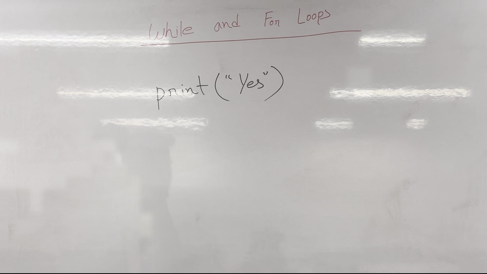
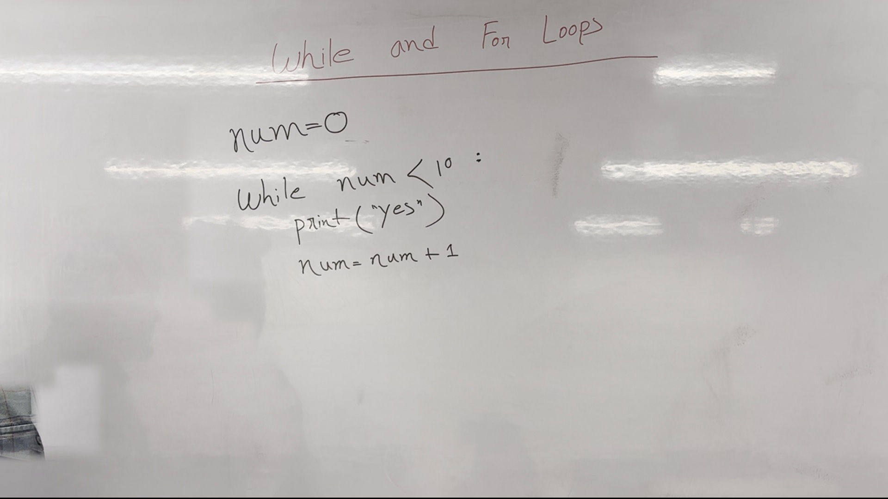
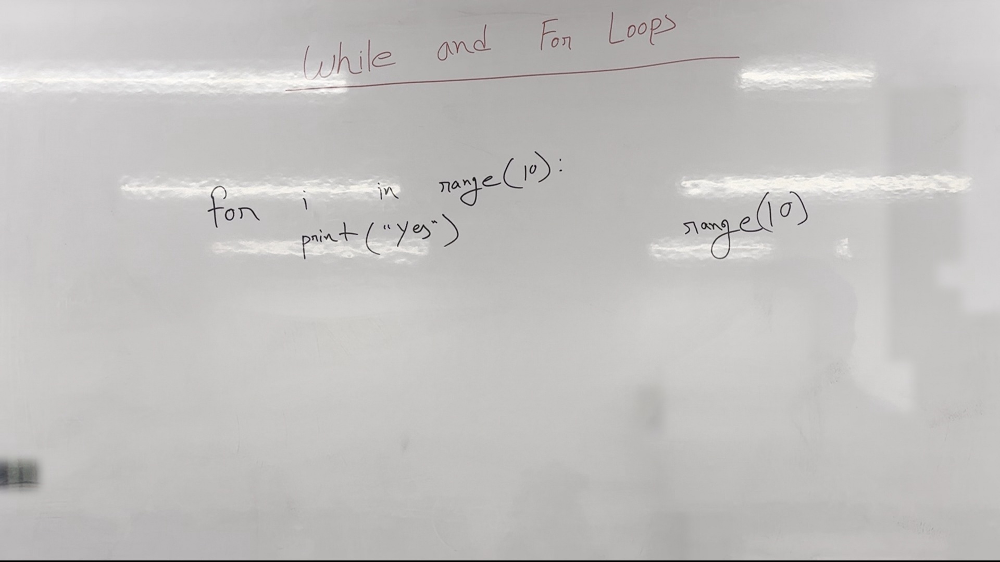
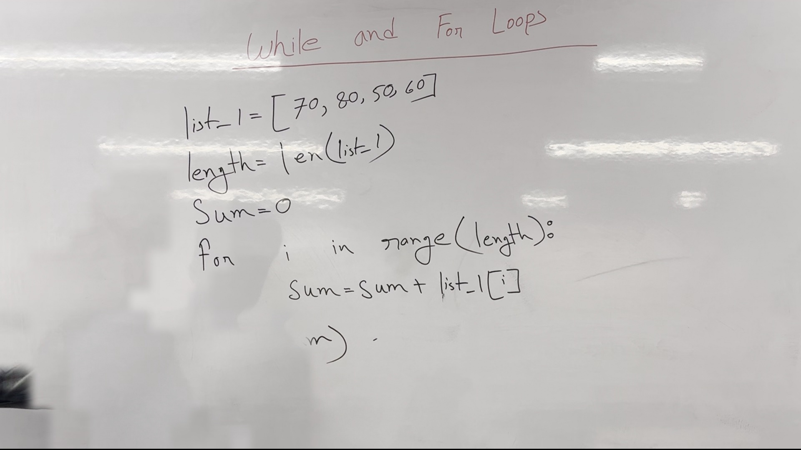

# Lecture Notes: Python Fundamentals - Loops

## Introduction
Welcome back to our last class of Python fundamentals. Today, we will dive into the concept of loops, specifically `while` and `for` loops. Loops are essential for performing repetitive tasks efficiently. 




**Figure 1.** Whiteboard as it stood during 0:00&ndash;1:10, reconstructed from 8 video frames with the lecturer removed. 97.9% of the board is unobstructed.

## Loops in Python
Loops allow us to execute a block of code repeatedly until a certain condition is met. We will cover two types of loops today: `while` loops and `for` loops.

### While Loop
A `while` loop continues executing as long as a specified condition is true. Once the condition becomes false, the loop stops.




**Figure 2.** Whiteboard as it stood during 1:20&ndash;3:10, reconstructed from 3 video frames with the lecturer removed. 98.2% of the board is unobstructed.

#### Example: Using a `while` Loop
```python
name = 0  # Initial value of the variable
while name < 10:  # Condition to check
    print(name)  # Action to perform
    name += 1  # Increment the variable
```
In this example, the loop runs as long as `name` is less than 10. Each time through the loop, the value of `name` is printed and incremented by 1.

### For Loop
A `for` loop is used for iterating over a sequence (such as a list, tuple, string, etc.). It executes a block of code once for each item in the sequence.




**Figure 3.** Whiteboard as it stood during 3:20&ndash;4:30, reconstructed from 4 video frames with the lecturer removed. 97.9% of the board is unobstructed.

#### Example: Using a `for` Loop
```python
for i in range(10):  # Loop through numbers 0 to 9
    print(i)  # Action to perform
```
In this example, the loop runs 10 times, printing the numbers from 0 to 9.

#### Explanation of `range()` Function
The `range()` function generates a sequence of numbers. The basic syntax is `range(start, stop, step)`. Here, `start` is optional and defaults to 0, `stop` is required, and `step` is optional and defaults to 1.

### Practical Example: Summing a List
Let's consider a practical example where we sum the elements of a list using a `for` loop.

#### Example: Summing Elements of a List
```python
list1 = [70, 50, 20, 60]  # Sample list
sum_value = 0  # Initialize sum to 0

for i in range(len(list1)):  # Iterate over the length of the list
    sum_value += list1[i]  # Update sum with each element
    print(sum_value)  # Print the current sum after each iteration

print(f"Total sum: {sum_value}")  # Print the final sum
```

In this example, the loop iterates over the elements of `list1`, updating the `sum_value` with each element and printing the cumulative sum after each iteration. Finally, the total sum is printed.

## Summary
Today, we covered the basics of loops in Python, focusing on `while` and `for` loops. We learned how to use `while` loops for repetitive tasks based on a condition and `for` loops for iterating over sequences. We also explored the `range()` function and its usage in generating a sequence of numbers for `for` loops. By understanding these concepts, you can automate repetitive tasks efficiently in Python.

We will continue our series next week, diving deeper into more advanced topics related to Python programming. Stay tuned!



**Figure 4.** Whiteboard as it stood during 5:30&ndash;9:00, reconstructed from 9 video frames with the lecturer removed. 98.0% of the board is unobstructed.


---

*Figures are reconstructed whiteboards. Each is assembled from tiles taken from moments when the lecturer was not standing in front of that part of the board, so every pixel is unmodified video; nothing is generated. A figure shows the board's state across the time range given, not a single instant. Boards less than 95% clear of the lecturer were left out.*
