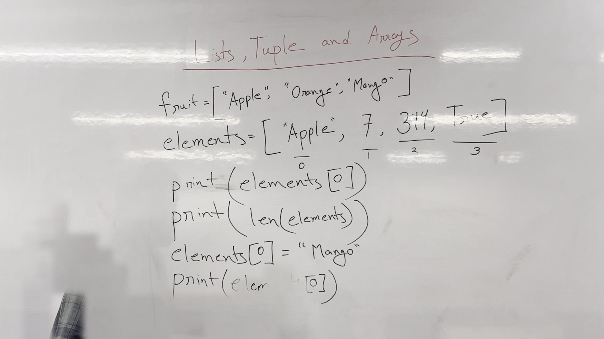
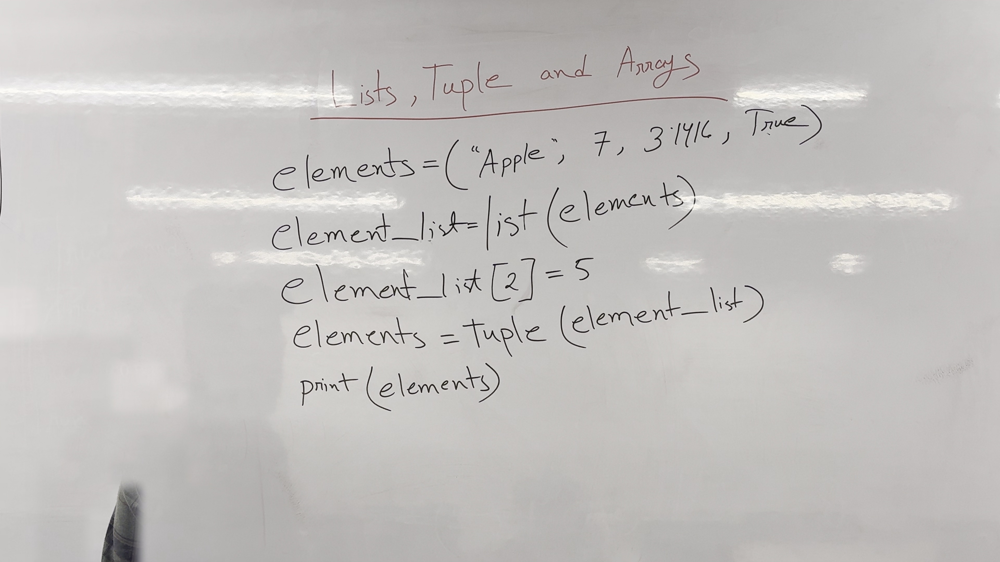
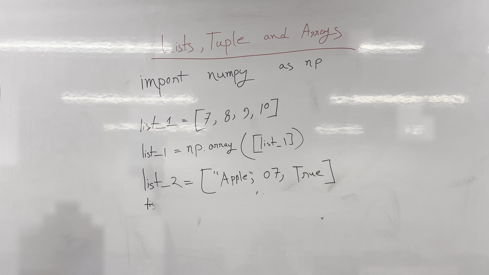

# Python Lists, Tuples, Arrays, and Error Handling

In this lecture, we will explore Python lists, tuples, and arrays, along with basic error handling.

## Key takeaways
- Python lists are flexible and can contain various data types.
- Tuples are similar to lists but are immutable.
- Arrays in Python can be created using the `numpy` library.
- Understanding indexing and updating lists is crucial.

## Python Lists
- Lists are a flexible data type in Python that can store multiple items.
- Example: `fruit = ["Apple", "Orange", "Mango"]`
- Example: `elements = ["Apple", 7, 3.14, True]`
- Accessing elements: `print(elements[0])` prints "Apple".
- Length of list: `print(len(elements))` prints 4.
- Updating elements: `elements[0] = "Mango"` changes the first element to "Mango".

*Figure 1. The whiteboard during 0:00–6:00, reconstructed from 10 video frames with the lecturer removed; 97% of the board is unobstructed.*

## Python Tuples
- Tuples are similar to lists but are immutable.
- Example: `Elements = ("Apple", 7, 3.1416, True)`
- Converting tuple to list: `element_list = list(elements)`
- Updating elements: `element_list[2] = 5`
- Converting back to tuple: `elements = tuple(element_list)`
- Printing updated tuple: `print(elements)`

*Figure 2. The whiteboard during 7:10–10:40, reconstructed from 10 video frames with the lecturer removed; 96% of the board is unobstructed.*

## Python Arrays
- Arrays in Python can be created using the `numpy` library.
- Example: `import numpy as np`
- Creating an array from a list: `list_1 = [7, 8, 9, 10]` and `list_1 = np.array([list_1])`
- Example: `list_2 = ["Apple", 07, True]` (Note: `07` should be `7`)

*Figure 3. The whiteboard during 11:00–14:00, reconstructed from 5 video frames with the lecturer removed; 98% of the board is unobstructed.*

## Check yourself
1. Create a list with three fruits.
2. Print the second element of the list.
3. Update the first element of the list to "Mango".
4. Convert a tuple to a list and update an element.
5. Import the `numpy` library and create an array from a list.

## Answers
1. `fruits = ["Apple", "Orange", "Mango"]`
2. `print(fruits[1])` prints "Orange".
3. `fruits[0] = "Mango"`
4. `elements = ("Apple", 7, 3.1416, True)`; `element_list = list(elements)`; `element_list[2] = 5`; `elements = tuple(element_list)`
5. `import numpy as np`; `array = np.array([7, 8, 9, 10])`

---

*Figures are reconstructed whiteboards assembled from moments when the lecturer was not standing in front of each part of the board. Every pixel is unmodified video; nothing in them is generated. Each shows the board across the time range given, not a single instant.*