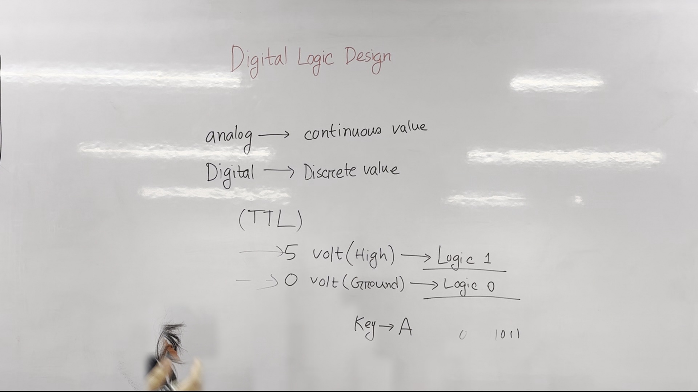
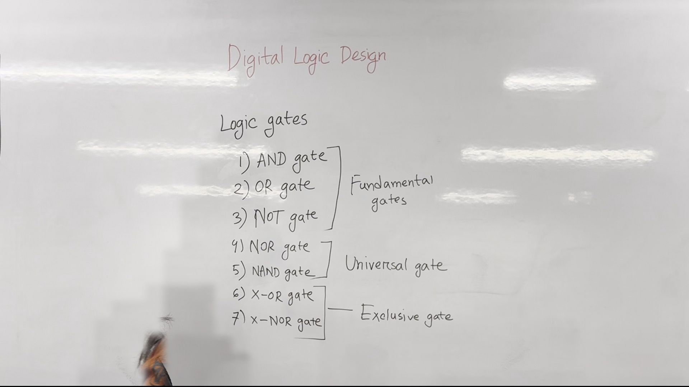
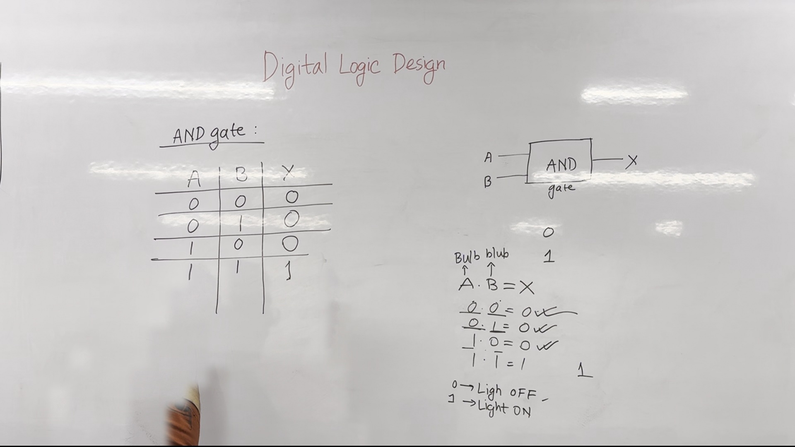
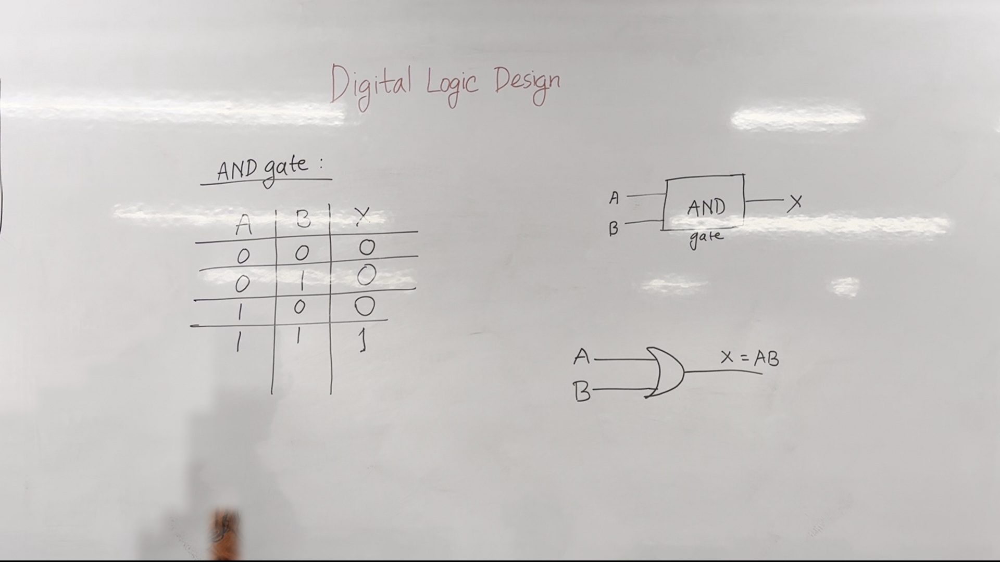
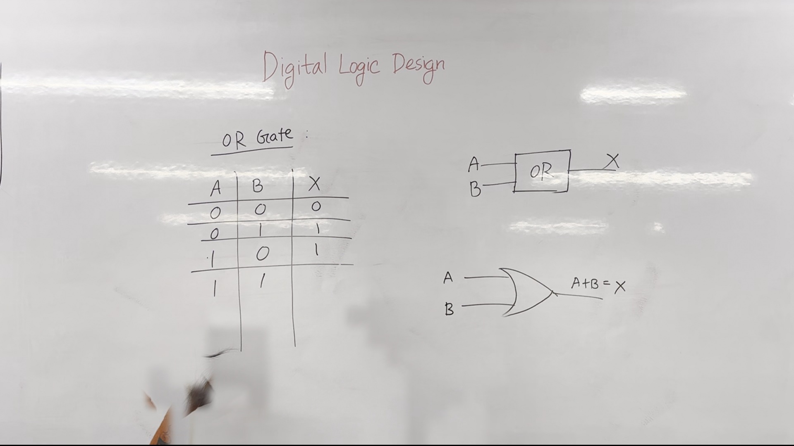
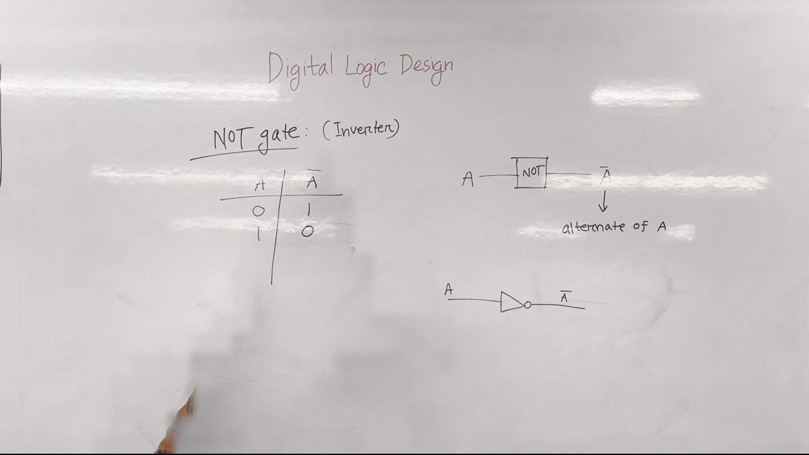

# Digital Logic Design Lecture Notes

## Introduction to Digital Logic Design
Welcome to the first lecture of Digital Logic Design. Today, we will explore the fundamental concepts of digital logic design and understand how computers operate using binary signals.

### Key Definitions
- **Digital**: Discrete values. In digital systems, data and signals are represented using a finite number of distinct levels.
- **Discrete Value**: Values that are separate and distinct from each other, often represented by binary digits (0 and 1).




**Figure 1.** Whiteboard as it stood during 0:10&ndash;3:10, reconstructed from 9 video frames with the lecturer removed. 97.2% of the board is unobstructed.

## Analog vs. Digital Signals
In the past, we have used analog signals, which represent continuous values. However, modern computers use digital signals, which represent discrete values (0 and 1). This transition allows for more precise and reliable processing.

### Analog Signals
- **Analog Signal**: Continuous signal that can take on any value within a range.
- **Example**: Temperature, which can vary continuously.

### Digital Signals
- **Digital Signal**: Discrete signal that takes on specific, distinct values.
- **Example**: Light switch, which can be either "on" (1) or "off" (0).




**Figure 2.** Whiteboard as it stood during 3:20&ndash;5:50, reconstructed from 8 video frames with the lecturer removed. 97.0% of the board is unobstructed.

## Binary Logic and TTL Signals
The computer operates using binary logic, where signals can only be 0 or 1. These values are maintained using TTL (Transistor-Transistor Logic) circuits.

### TTL Signal Levels
- **High Voltage**: Typically 5 volts (V).
- **Low Voltage**: Ground (0 volts).

### Example: Keyboard Input
The keyboard sends input signals to the computer, which are either high or low. For instance:
```python
if input_signal == 5V:
    print("High")
elif input_signal == 0V:
    print("Low")
```




**Figure 3.** Whiteboard as it stood during 6:00&ndash;10:00, reconstructed from 9 video frames with the lecturer removed. 97.7% of the board is unobstructed.

## Logic Gates
Logic gates are fundamental building blocks of digital circuits. They perform basic logical operations on binary inputs to produce binary outputs.

### Types of Logic Gates
- **AND Gate**
- **NOT Gate**
- **NAND Gate**
- **NOR Gate**
- **XOR Gate**
- **XNOR Gate**

### AND Gate
- **Definition**: An AND gate outputs 1 only if both inputs are 1.
- **Truth Table**:
  ```markdown
  | A | B | Output |
  |---|---|--------|
  | 0 | 0 |   0    |
  | 0 | 1 |   0    |
  | 1 | 0 |   0    |
  | 1 | 1 |   1    |
  ```




**Figure 4.** Whiteboard as it stood during 10:10&ndash;11:00, reconstructed from 4 video frames with the lecturer removed. 97.5% of the board is unobstructed.

### Example: AND Gate Circuit
Here’s how an AND gate works with two inputs, A and B:
```python
def and_gate(A, B):
    return A and B
```
- **Explanation**: If A is 1 and B is 1, the output is 1. Otherwise, the output is 0.

### NOT Gate
- **Definition**: A NOT gate inverts the input. If the input is 0, the output is 1, and vice versa.
- **Truth Table**:
  ```markdown
  | A | Output |
  |---|--------|
  | 0 |   1    |
  | 1 |   0    |
  ```

### Example: NOT Gate Circuit
```python
def not_gate(A):
    return not A
```
- **Explanation**: If A is 1, the output is 0. If A is 0, the output is 1.




**Figure 5.** Whiteboard as it stood during 11:10&ndash;13:00, reconstructed from 8 video frames with the lecturer removed. 96.6% of the board is unobstructed.

### NAND and NOR Gates
- **NAND Gate**: Outputs 0 only if both inputs are 1.
- **NOR Gate**: Outputs 1 only if both inputs are 0.

### Exclusive OR (XOR) and Exclusive NOR (XNOR) Gates
- **XOR Gate**: Outputs 1 if the inputs are different.
- **XNOR Gate**: Outputs 1 if the inputs are the same.

## Fundamental and Universal Gates
- **Fundamental Gates**: AND, NOT, OR, NAND, NOR, XOR
- **Universal Gate**: NAND or NOR, as they can implement all other gates.




**Figure 6.** Whiteboard as it stood during 13:10&ndash;14:50, reconstructed from 7 video frames with the lecturer removed. 97.4% of the board is unobstructed.

## Summary
- **Digital Signals**: Represent discrete values (0 and 1).
- **TTL Signals**: Maintain high (5V) and low (0V) voltage levels.
- **Logic Gates**: Perform basic logical operations.
- **AND Gate**: Outputs 1 only if both inputs are 1.
- **NOT Gate**: Inverts the input.
- **NAND, NOR, XOR, XNOR Gates**: Implement various logical operations.

By understanding these fundamental concepts, we can design and analyze digital circuits effectively.

---

*Figures are reconstructed whiteboards. Each is assembled from tiles taken from moments when the lecturer was not standing in front of that part of the board, so every pixel is unmodified video; nothing is generated. A figure shows the board's state across the time range given, not a single instant. Boards less than 95% clear of the lecturer were left out.*
