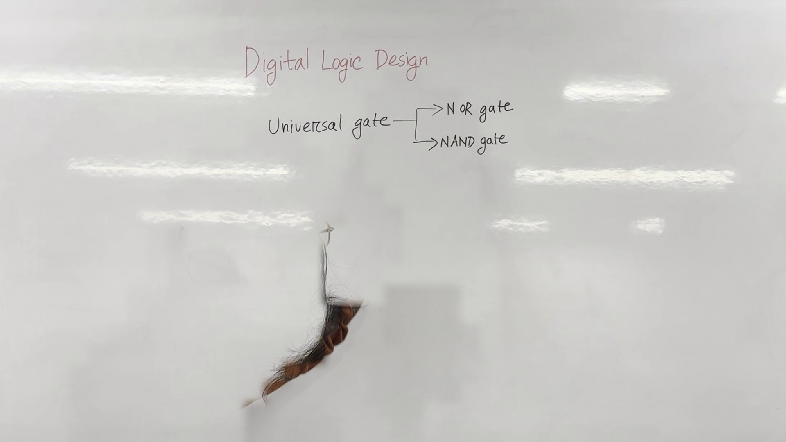
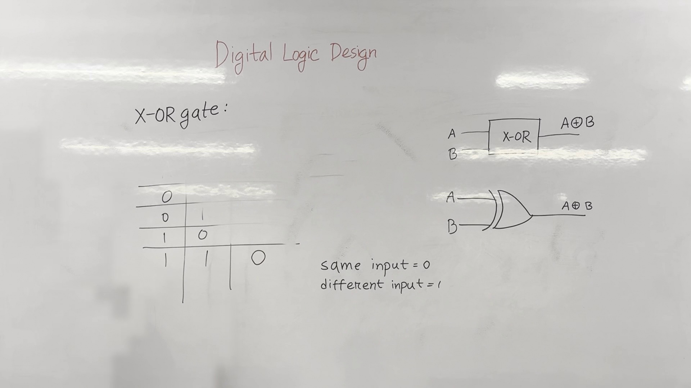

# Lecture Notes: Digital Logic Design

## Introduction
Welcome to the second class of Digital Logic Design. Today, we will focus on understanding the fundamental gates and the concept of universal gates.




**Figure 1.** Whiteboard as it stood during 0:00&ndash;0:50, reconstructed from 6 video frames with the lecturer removed. 95.1% of the board is unobstructed.

## Universal Gates
Universal gates are a set of logic gates from which all other logic gates can be constructed. There are two main types of universal gates: **NOR** and **NAND** gates.

### NOR Gate
The **NOR gate** is a digital logic gate that implements logical NOR—it behaves according to the truth table where the output is true if both the inputs are false. Otherwise, the output is false.


**Figure 2.** Whiteboard as it stood during 1:00&ndash;4:20, reconstructed from 9 video frames with the lecturer removed. 100.0% of the board is unobstructed.

#### Truth Table
| A | B | Output |
|---|---|--------|
| 0 | 0 | 1      |
| 0 | 1 | 0      |
| 1 | 0 | 0      |
| 1 | 1 | 0      |

#### Circuit Diagram
```plaintext
A --\
     \ NOR Gate
B ----/
```

### NAND Gate
The **NAND gate** is another type of universal gate. It is the inverse of the AND gate, meaning that the output is true only when both inputs are false.

#### Truth Table
| A | B | Output |
|---|---|--------|
| 0 | 0 | 1      |
| 0 | 1 | 1      |
| 1 | 0 | 1      |
| 1 | 1 | 0      |

#### Circuit Diagram
```plaintext
A --\
     \ NAND Gate
B ----/
```

## Exclusive OR (XOR) Gate
The **XOR gate** is a digital logic gate that gives a true (1) output when the number of true inputs is odd. It is useful for performing addition in binary arithmetic.


**Figure 3.** Whiteboard as it stood during 4:40&ndash;7:00, reconstructed from 6 video frames with the lecturer removed. 100.0% of the board is unobstructed.

#### Truth Table
| A | B | Output |
|---|---|--------|
| 0 | 0 | 0      |
| 0 | 1 | 1      |
| 1 | 0 | 1      |
| 1 | 1 | 0      |

#### Circuit Diagram
```plaintext
A --\
     \ XOR Gate
B ----/
```

### Formula for XOR
The output of the XOR gate can be expressed using the following formula:
\[ \text{Output} = (A \land \neg B) \lor (\neg A \land B) \]

Where:
- \( \land \) denotes AND
- \( \lor \) denotes OR
- \( \neg \) denotes NOT




**Figure 4.** Whiteboard as it stood during 7:20&ndash;10:40, reconstructed from 4 video frames with the lecturer removed. 100.0% of the board is unobstructed.

### Logical Circuit Example
To understand the XOR gate better, let's construct a logical circuit for \( A \oplus B \) (where \( \oplus \) represents XOR).

1. First, calculate \( \neg A \) and \( \neg B \).
2. Compute \( A \land \neg B \) and \( \neg A \land B \).
3. Finally, compute \( (A \land \neg B) \lor (\neg A \land B) \).

This results in the following logical circuit:

```plaintext
A --\
     \ NOT
B ----\
         \
          OR
         / \
        /   \
       /     \
      /       \
     /         \
    /           \
   /             \
  /               \
 /                 \
/                   \
NOT B --\            /
         \          /
          \        /
           \      /
            \    /
             \  /
              OR
             /  \
            /    \
           /      \
          /        \
         /          \
        /            \
       /              \
      /                \
     /                  \
    /                    \
   /                      \
  /                        \
 /                          \
/                            \
NOT A --\                     /
         \                    /
          \                  /
           \                /
            \              /
             \            /
              \          /
               \        /
                \      /
                 \    /
                  \  /
                   \/
                    Output
```

## Summary
In this lecture, we covered the basics of universal gates, specifically the NOR and NAND gates. We discussed their truth tables and circuit diagrams. Additionally, we introduced the XOR gate, its truth table, and a logical circuit example. Understanding these gates is crucial for constructing more complex digital circuits and performing binary arithmetic operations.

By the end of this class, you should be familiar with:
- Definitions of universal gates (NOR, NAND, AND, OR, NOT)
- Truth tables and circuit diagrams for each gate
- The concept of XOR and its application in digital logic design

Feel free to ask any questions or clarify any doubts.


**Figure 5.** Whiteboard as it stood during 10:50&ndash;14:00, reconstructed from 9 video frames with the lecturer removed. 100.0% of the board is unobstructed.


---

*Figures are reconstructed whiteboards. Each is assembled from tiles taken from moments when the lecturer was not standing in front of that part of the board, so every pixel is unmodified video; nothing is generated. A figure shows the board's state across the time range given, not a single instant. Boards less than 95% clear of the lecturer were left out.*
