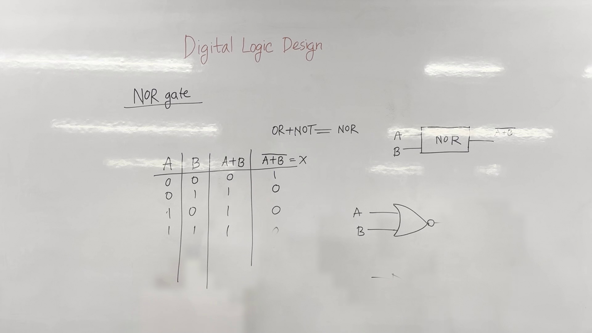
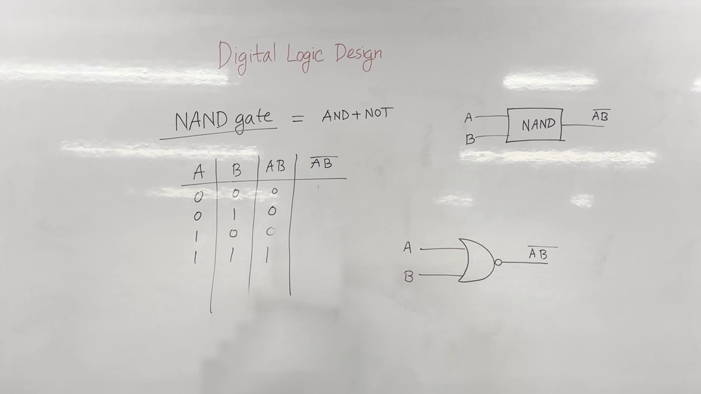
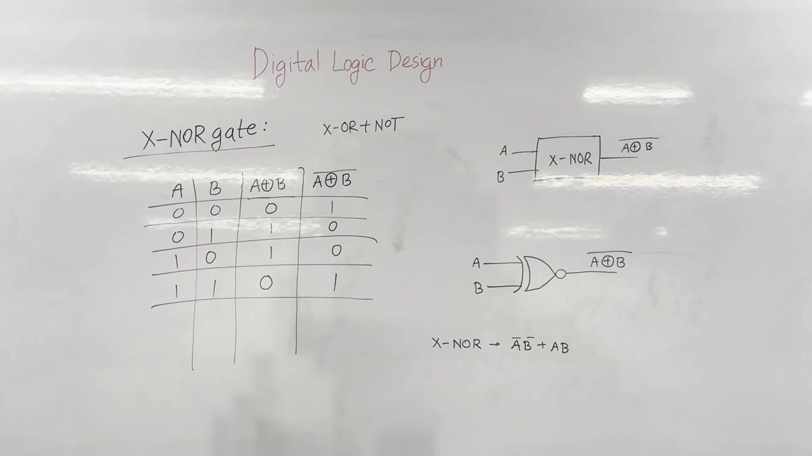

# Digital Logic Design

One sentence: This lecture covers the introduction to universal gates, specifically NOR and NAND gates, and introduces XOR and XNOR gates.

## Key takeaways
- Universal gates are fundamental gates that can be used to implement any other logic gate.
- NOR and NAND gates are universal gates.
- XOR and XNOR gates are exclusive gates.

## Universal Gates
### NOR Gate
The NOR gate is a universal gate that can be constructed using an OR gate followed by a NOT gate.

**Core Idea:** The NOR gate takes two inputs and produces an output that is the negation of the OR operation on the inputs.

**Worked Example:**
```markdown
| A | B | A+B | NOT(A+B) = X |
|---|---|-----|--------------|
| 0 | 0 |   0 |            1 |
| 0 | 1 |   1 |            0 |
| 1 | 0 |   1 |            0 |
| 1 | 1 |   1 |            0 |
```


*Figure 2. The whiteboard during 1:00–4:20, reconstructed from 9 video frames with the lecturer removed; 100% of the board is unobstructed.*

**Watch out:** The output of a NOR gate is `1` only when both inputs are `0`.

### NAND Gate
The NAND gate is another universal gate that can be constructed using an AND gate followed by a NOT gate.

**Core Idea:** The NAND gate takes two inputs and produces an output that is the negation of the AND operation on the inputs.

**Worked Example:**
```markdown
| A | B | AB | NOT(AB) |
|---|---|----|---------|
| 0 | 0 | 0  | 1       |
| 0 | 1 | 0  | 1       |
| 1 | 0 | 0  | 1       |
| 1 | 1 | 1  | 0       |
```


*Figure 3. The whiteboard during 4:40–7:00, reconstructed from 6 video frames with the lecturer removed; 100% of the board is unobstructed.*

## Exclusive Gates
### XOR Gate
The XOR gate is an exclusive gate that outputs `1` only when the inputs are different.

**Core Idea:** The XOR gate takes two inputs and produces an output that is `1` if the inputs are different, otherwise `0`.

**Worked Example:**
```markdown
|   | 0 | 1 |
|---|---|---|
| 0 | 0 | 1 |
| 1 | 1 | 0 |
```

**Worked Example:**
```markdown
A → X-OR → A⊕B
B
```

**Watch out:** The output of an XOR gate is `1` only when the inputs are different.

### XNOR Gate
The XNOR gate is the complement of the XOR gate, meaning it outputs `1` only when the inputs are the same.

**Core Idea:** The XNOR gate takes two inputs and produces an output that is `1` if the inputs are the same, otherwise `0`.

**Worked Example:**
```markdown
| A | B | A⊕B | A⊕B |
|---|---|-----|-----|
| 0 | 0 |   0 |   1 |
| 0 | 1 |   1 |   0 |
| 1 | 0 |   1 |   0 |
| 1 | 1 |   0 |   1 |
```


*Figure 5. The whiteboard during 10:50–14:00, reconstructed from 9 video frames with the lecturer removed; 100% of the board is unobstructed.*

**Watch out:** The output of an XNOR gate is `1` only when the inputs are the same.

## Check yourself
1. What is the output of a NOR gate when both inputs are `0`?
2. How many possible combinations of inputs are there for a NAND gate?
3. What is the output of an XOR gate when the inputs are `1` and `0`?
4. What is the output of an XNOR gate when both inputs are `1`?
5. Draw the gate diagram for a NOR gate.

## Answers
1. The output of a NOR gate when both inputs are `0` is `1`.
2. There are four possible combinations of inputs for a NAND gate.
3. The output of an XOR gate when the inputs are `1` and `0` is `1`.
4. The output of an XNOR gate when both inputs are `1` is `1`.
5. The gate diagram for a NOR gate is:
    ```
    A --- NOR --- A+B
    B
    ```

---

*Figures are reconstructed whiteboards assembled from moments when the lecturer was not standing in front of each part of the board. Every pixel is unmodified video; nothing in them is generated. Each shows the board across the time range given, not a single instant.*