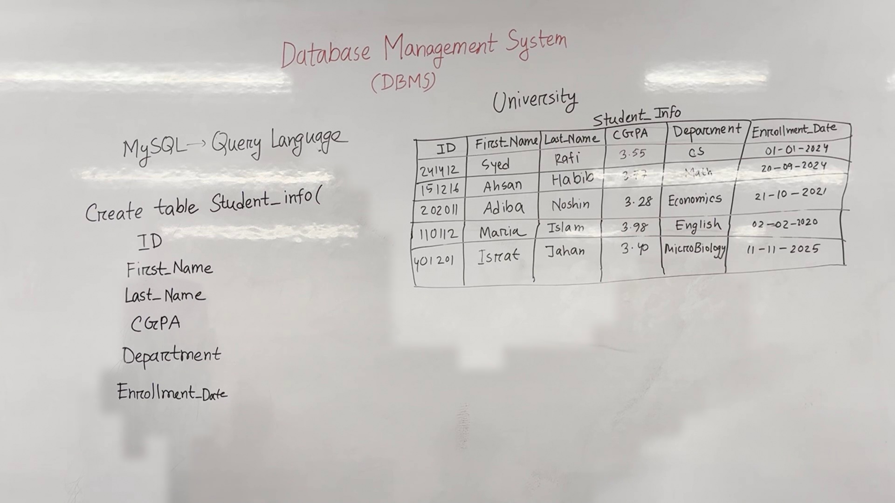

# Database Management System (DBMS)

One sentence: What this lecture covers.

## Key takeaways
- A database is a collection of structured data.
- SQL is used to manage databases.
- Tables in a database store specific types of data.
- Columns in a table represent different attributes of the data.
- Data types define how data is stored and manipulated.

## Database Management System (DBMS)
- A database is a collection of structured data that is organized and managed to facilitate easy access, maintenance, and management.
- Example: A university database stores information about students, including their IDs, names, CGPA, departments, and enrollment dates.

### Example Table: Student Information
- **Core Idea**: A table in a database stores specific types of data.
- **Worked Example**:
  - **Table Name**: `Student_Info`
  - **Columns**:
    - `ID`: Unique identifier for each student.
    - `First_Name`: First name of the student.
    - `Last_Name`: Last name of the student.
    - `CGPA`: Cumulative Grade Point Average.
    - `Department`: Department the student is enrolled in.
    - `Enrollment_Date`: Date of enrollment.

  - **Example Data**:
    ```markdown
    | ID | First_Name | Last_Name | CGPA | Department | Enrollment_Date |
    |----|------------|-----------|------|------------|----------------|
    | 241412 | Syed | Rafi | 3.55 | CS | 01-01-2024 |
    | 151216 | Ahsan | Habib | 3.77 | Math | 20-09-2024 |
    | 202011 | Adiba | Noshin | 3.28 | Economics | 21-10-2021 |
    | 110112 | Maria | Islam | 3.98 | English | 02-02-2020 |
    | 401201 | Istrat | Jahan | 3.40 | MicroBiology | 11-11-2025 |
    ```



*Figure 1. The whiteboard during 1:10–10:50, reconstructed from 5 video frames with the lecturer removed; 100% of the board is unobstructed.*

- **Watch out:** Ensure that each column has a defined data type to properly store and manipulate the data.

### Creating a Table Using SQL
- **Core Idea**: SQL is used to create and manipulate tables in a database.
- **Worked Example**:
  - **SQL Command**:
    ```sql
    CREATE TABLE Student_Info (
      ID INT,
      First_Name VARCHAR(10),
      Last_Name VARCHAR(10),
      CGPA FLOAT,
      Department VARCHAR(15),
      Enrollment_Date DATE
    );
    ```

  - **Explanation**:
    - `ID` is an integer.
    - `First_Name` and `Last_Name` are strings with a maximum length of 10 characters.
    - `CGPA` is a floating-point number.
    - `Department` is a string with a maximum length of 15 characters.
    - `Enrollment_Date` is a date.


- **Watch out:** Ensure that the data types match the expected data to avoid errors.

## Check Yourself
1. What is a database?
2. What is SQL?
3. How many columns are in the `Student_Info` table?
4. What is the data type of the `Enrollment_Date` column?
5. What is the maximum length of the `First_Name` column?

## Answers
1. A database is a collection of structured data.
2. SQL is a query language used to manage databases.
3. There are six columns in the `Student_Info` table.
4. The data type of the `Enrollment_Date` column is `DATE`.
5. The maximum length of the `First_Name` column is 10 characters.

---

*Figures are reconstructed whiteboards assembled from moments when the lecturer was not standing in front of each part of the board. Every pixel is unmodified video; nothing in them is generated. Each shows the board across the time range given, not a single instant.*