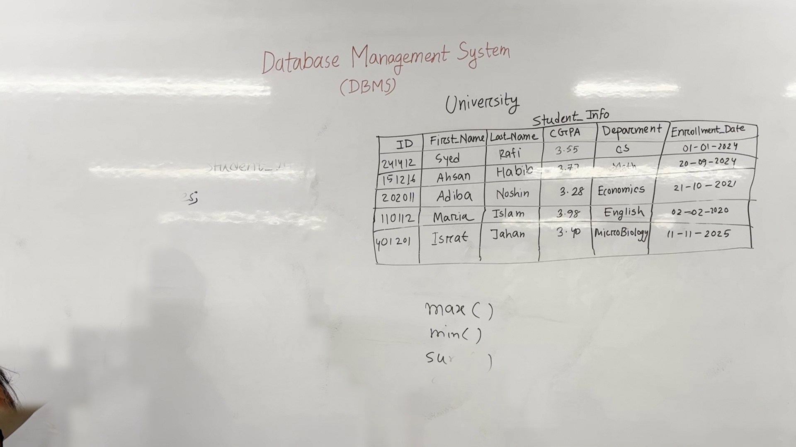
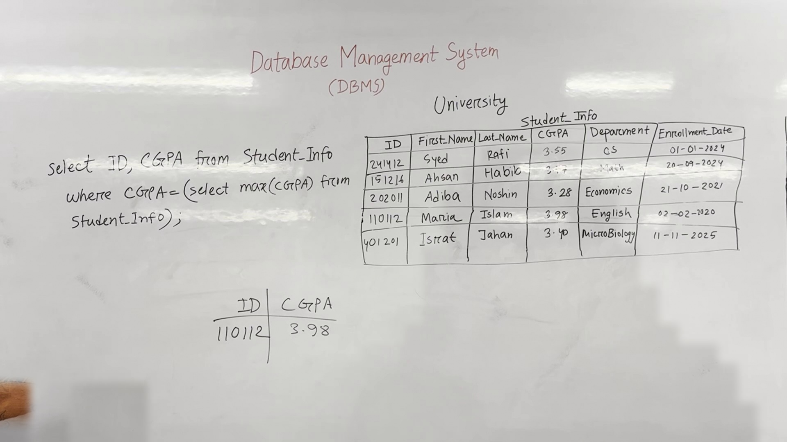

# Lecture Notes: SQL Queries and Data Retrieval

## Introduction
Welcome back! In our previous class, we learned how to create tables using SQL commands. Today, we will focus on the `SELECT` query, which is one of the most frequently used and important commands in SQL for retrieving data.

## SELECT Query
The `SELECT` query is used to retrieve specific data from a database. It allows us to filter and retrieve data based on certain conditions. Here are some key points about the `SELECT` query:

### Basic Syntax
```sql
SELECT column_name(s)
FROM table_name
[WHERE condition];
```




**Figure 1.** Whiteboard as it stood during 0:10&ndash;9:10, reconstructed from 13 video frames with the lecturer removed. 98.5% of the board is unobstructed.

### Example Queries

#### Retrieving Full Data
To retrieve all data from a table:
```sql
SELECT *
FROM Student_Info;
```

#### Retrieving Specific Columns
To retrieve specific columns:
```sql
SELECT First_Name, Last_Name
FROM Student_Info
WHERE ID = '202011';
```

#### Aggregation Functions
Aggregation functions such as `MAX`, `MIN`, `SUM`, and `AVG` can be used to perform operations on data.
```sql
SELECT MAX(CGPA)
FROM Student_Info;
```

### Order By Clause
The `ORDER BY` clause is used to sort the result set in ascending or descending order.
```sql
SELECT First_Name, Last_Name
FROM Student_Info
ORDER BY First_Name ASC;
```

### Aggregation Functions in Action
Let's see how to use aggregation functions with examples:

#### Maximum CGPA
```sql
SELECT MAX(CGPA)
FROM Student_Info;
```

#### Minimum CGPA
```sql
SELECT MIN(CGPA)
FROM Student_Info;
```

#### Sum of CGPA
```sql
SELECT SUM(CGPA)
FROM Student_Info;
```

#### Average CGPA
```sql
SELECT AVG(CGPA)
FROM Student_Info;
```

### Nested Queries
Nested queries allow us to retrieve data from multiple tables by combining multiple `SELECT` statements.
```sql
SELECT ID, MAX(CGPA)
FROM Student_Info;
```

### Summary
- The `SELECT` query is used to retrieve data from a database.
- Aggregation functions like `MAX`, `MIN`, `SUM`, and `AVG` can be used to perform operations on data.
- The `ORDER BY` clause sorts the results.
- Nested queries combine multiple `SELECT` statements to retrieve data from multiple tables.

## Key Definitions
- **ID**: A unique identifier for each student, e.g., `202011`.
- **CGPA**: Cumulative Grade Point Average, calculated using `SELECT MAX(CGPA) FROM Student_Info`.




**Figure 2.** Whiteboard as it stood during 9:20&ndash;16:20, reconstructed from 5 video frames with the lecturer removed. 99.0% of the board is unobstructed.

## Important Concepts
- **MicroBiology**: A field of study related to the structure, function, and classification of microorganisms.
- **DBMS**: Database Management System, which includes software for creating, maintaining, and managing databases.
- **CS**: Computer Science, a field of study that deals with the design and application of computer systems.
- **Database**: An organized collection of data that is stored and accessed electronically.
- **Management**: The process of planning, organizing, leading, and controlling resources to achieve goals.
- **System**: A set of interacting or interdependent components forming an integrated whole.
- **University**: An institution of higher education offering classes, research, and other educational activities.
- **Department**: A subdivision within an organization, typically focused on a specific subject or area of study.
- **Syed**: A title used in Islamic culture, often given to individuals of high status or importance.
- **Rafi**: A personal name.
- **Aban**: A personal name.
- **Habib**: A personal name.
- **Math**: Mathematics, the abstract science of number, quantity, and space.
- **Nashin**: A personal name.
- **Economics**: The social science concerned with the production, distribution, and consumption of goods and services.
- **Sam**: A personal name.
- **English**: A language spoken in many countries, including the United States and the United Kingdom.
- **Man**: A human being, male or female.

## Conclusion
Today, we learned how to use the `SELECT` query to retrieve data from a database. We also explored various aggregation functions and the `ORDER BY` clause. Next time, we will dive deeper into more complex SQL queries and database management techniques.

--- 

**Summary**
In today's lecture, we covered the basics of the `SELECT` query in SQL, including how to retrieve data, use aggregation functions, and sort results. We also discussed nested queries and their applications. Understanding these concepts is crucial for effectively querying and managing databases.

---

*Figures are reconstructed whiteboards. Each is assembled from tiles taken from moments when the lecturer was not standing in front of that part of the board, so every pixel is unmodified video; nothing is generated. A figure shows the board's state across the time range given, not a single instant. Boards less than 95% clear of the lecturer were left out.*
